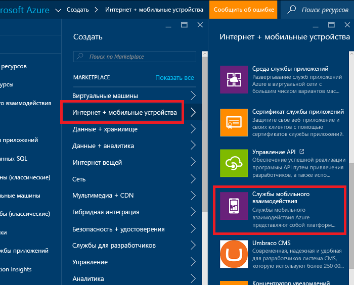
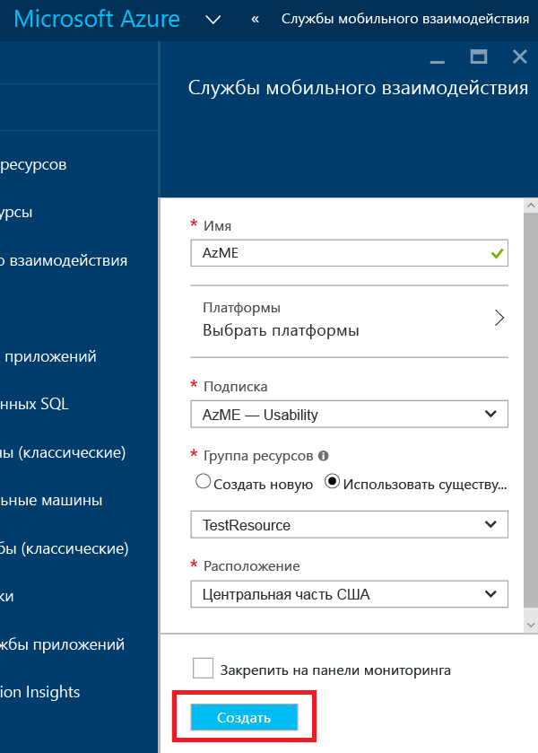
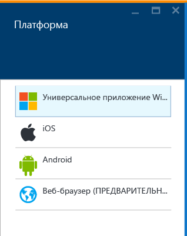
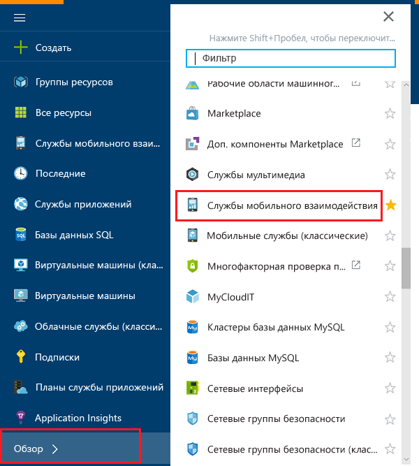
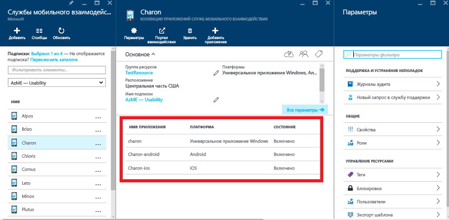
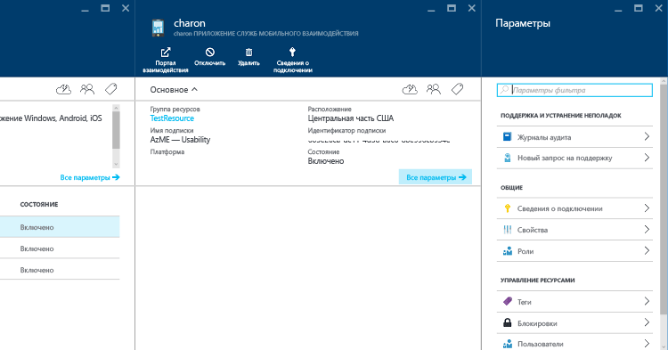

1. Войдите на [портал Azure](https://portal.azure.com).
2. Щелкните **Создать**, **Интернет+мобильные устройства**, а затем выберите **Службы мобильного взаимодействия**.
   
    
3. В появившейся колонке **New Mobile Engagement App Collection** (Новая коллекция приложений Mobile Engagement) мы создадим коллекцию приложений вместо приложения, как на классическом портале Azure. Введите следующие сведения:
   
    
   
   * **Имя**: Имя of your *коллекции приложений* 
   * **Платформы** — выберите целевые платформы для приложения в открывшейся колонке "Платформы". Например:  если требуется приложение для платформ iOS и Android, то выберите обе платформы. Таким образом, в коллекции приложений будут созданы два приложения. 
     
      
   * **Подписка**— выберите подписку Azure. 
   * **Группа ресурсов**— выберите группу ресурсов Azure, в которой нужно разместить ресурс Azure, а именно коллекцию приложений Mobile Engagement. Можно также создать новую группу.  
   * **Расположение** — регион, где будут храниться данные о приложении и коллекции приложений.
4. Выберите **Обзор**, чтобы просмотреть коллекции приложений мобильного взаимодействия и найдите **Службы мобильного взаимодействия**.
   
    
5. Отобразится список коллекций приложений мобильного взаимодействия. Убедитесь, что используется та же подписка Azure, в которой была создана коллекция приложений.
   
    
6. Щелкните коллекцию приложений, созданную на предыдущем шаге, чтобы открыть колонку ресурсов коллекции приложений. В этой колонке отобразятся приложения, содержащиеся в коллекции. 
   
    
7. Выберите приложение, созданное для соответствующей платформы. 
   
    
8. В верхней части страницы нажмите кнопку **Сведения о подключении**. В открывшейся колонке скопируйте строку подключения. 
   
    

<!--HONumber=Nov16_HO2-->

