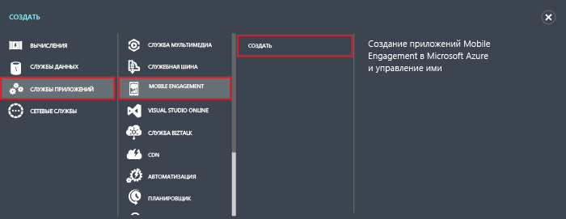
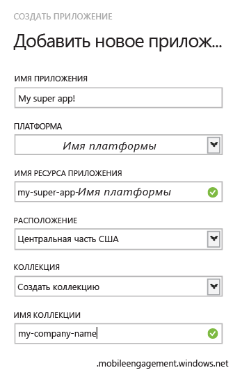

1. Войдите на [классический портал Azure](https://manage.windowsazure.com) и в нижней части экрана нажмите кнопку **Создать**.

2. Щелкните **Службы приложений**, **Mobile Engagement**, а затем **Создать**.

   	

3. Во всплывающем окне введите следующую информацию:

   	

	- **Имя приложения**: имя вашего приложения. 
	- **Платформа**: целевая платформа для приложения. Необходимо создать по одному приложению Mobile Engagement для каждой платформы, на которой будет использоваться мобильное приложение. 
	- **Имя ресурса приложения**: имя, по которому приложение можно будет открывать через API или используя URL-адрес. 
	- **Расположение**: центр обработки данных, в котором будет размещаться приложение и коллекция приложений.
	- **Коллекция**: укажите существующую или создайте новую коллекцию.
	- **Имя коллекции**: имя вашей группы приложений. Все ваши приложения будут добавлены в одну группу, что позволит агрегировать метрики. Здесь следует указать имя вашей компании или отдела, если применимо.

4. На вкладке **Приложения** выберите только что созданное приложение.

5. Щелкните **Информация о подключении**, чтобы отобразить параметры подключения, которые следует использовать при интеграции пакета SDK в вашем мобильном приложении.

6. Скопируйте **строку подключения**. Она понадобится, чтобы идентифицировать данное приложение в коде приложения и подключиться к Mobile Engagement из приложения.

   	

<!---HONumber=AcomDC_0128_2016-->