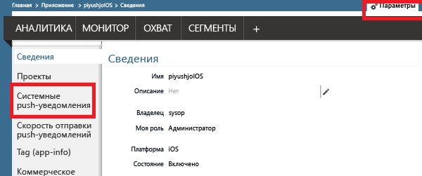
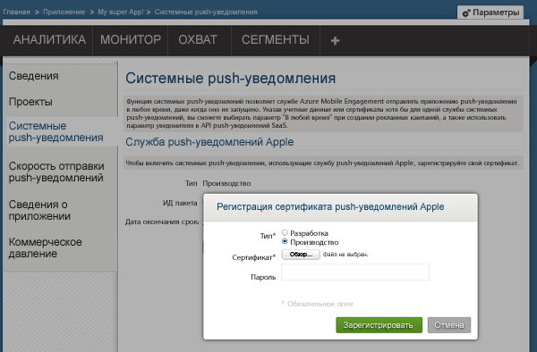
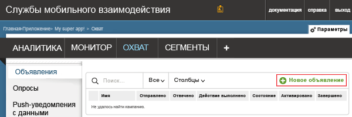
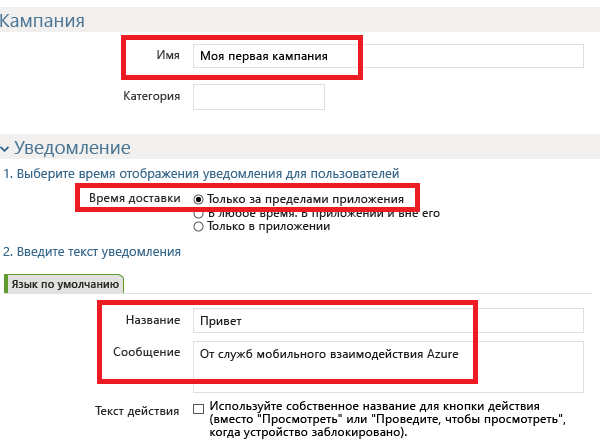
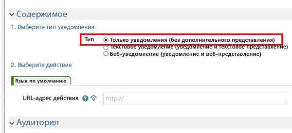
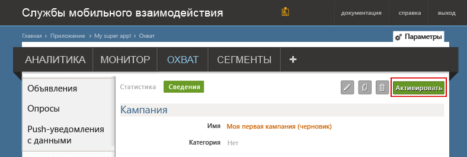

###Предоставьте доступ к сертификату push-уведомлений для Mobile Engagement

Чтобы разрешить Mobile Engagement отправлять push-уведомления от вашего имени, необходимо предоставить доступ к сертификату. Это можно сделать путем настройки и ввода сертификата на портале Mobile Engagement. Убедитесь, что получили сертификат P12, как описано в [документации Apple](https://developer.apple.com/library/prerelease/ios/documentation/IDEs/Conceptual/AppDistributionGuide/AddingCapabilities/AddingCapabilities.html#//apple_ref/doc/uid/TP40012582-CH26-SW6).

1. Перейдите на портал Mobile Engagement. Убедитесь, что все правильно, и нажмите кнопку **Выполнить охват** внизу.

	

2. Щелкните станицу **Параметры** на портале Mobile Engagement. Выберите здесь раздел **Системное push-уведомление**, чтобы передать ваш сертификат P12:

	

3. Выберите сертификат P12, отправьте его и введите пароль:

	

##Отправка уведомления в приложение

Создадим простую кампанию push-уведомлений, которая отправит push-уведомление в приложение.

1. Перейдите на вкладку **Рекламная кампания** на портале Mobile Engagement.

2. Щелкните **Создать объявление**, чтобы создать кампанию push-уведомлений.

	

3. Настройте первые поля кампании:

	

	- 	Задайте **имя** кампании. 
	- 	Выберите **время доставки** **Только за пределами приложения** — это простой тип push-уведомлений Apple с произвольным текстом.
	- 	В тексте уведомления введите сначала **заголовок** в первой строке push-уведомления.
	- 	Затем введите **сообщение** во второй строке.

4. Прокрутите окно вниз и в разделе содержимого выберите пункт **Только уведомления**.

	

5. Вы настроили простейшую кампанию. Теперь прокрутите окно вниз и нажмите кнопку **Создать**, чтобы сохранить push-уведомлений.

6. Наконец, щелкните **Активировать**, чтобы отправить push-уведомление.

	

 

<!---HONumber=Oct15_HO3-->