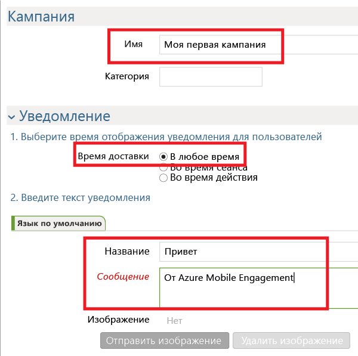
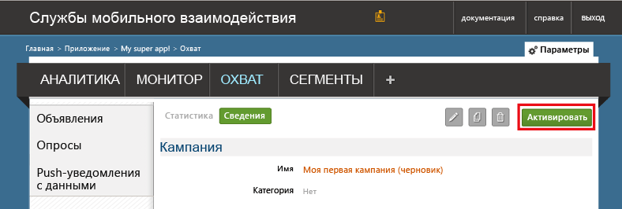

Теперь мы создадим простую кампанию push-уведомлений, которая будет отправлять push-уведомления в приложение.

1. Перейдите на вкладку **РЕКЛАМНАЯ КАМПАНИЯ** на портале Mobile Engagement.

2. Щелкните **Создать объявление**, чтобы создать кампанию push-уведомлений.

	

3. Выполните следующие шаги, чтобы настроить первое поле кампании:

	

	а. Задайте **имя** кампании.

	b. Для параметра **Время доставки** выберите значение *Любое время*.

	г) В тексте уведомления введите **заголовок**, которой будет отображаться полужирным шрифтом в push-уведомлении.

	д. Затем введите текст **сообщения**.

4. Прокрутите окно вниз и в разделе **содержимого** выберите пункт **Только уведомления**.

	

5. Вы настроили простейшую базовую кампанию. Еще раз прокрутите окно вниз и нажмите кнопку **Создать**, чтобы сохранить кампанию.

6. Напоследок щелкните **Активировать**, чтобы активировать кампанию и начать отправку push-уведомлений.

	

 

<!---HONumber=Oct15_HO3-->