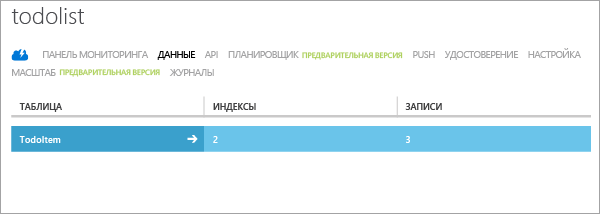

Последний раздел учебника — построение и выполнение нового приложения.

### Загрузка проекта в Android Studio и синхронизация с Gradle
1. Перейдите в расположение, где сохранены сжатые файлы проекта, и извлеките файлы на компьютере в каталог проектов Android Studio.
2. Откройте Android Studio. Если вы работаете с некоторым проектом и он отображается, закройте этот проект ("Файл" = > "Закрыть проект").
3. Выберите **Открыть существующий проект Android Studio**, перейдите к папке с проектом и нажмите кнопку **ОК**. Проект буден загружен, и начнется его синхронизация с Gradle.
   
     
4. Дождитесь завершения синхронизации с Gradle. Если версия, используемая в Android Studio, не совпадает с версией примера, может появиться ошибка «Не удалось найти целевой объект». Чтобы устранить эту проблему, щелкните в окне сообщения об ошибке ссылку **Установить отсутствующие платформы и синхронизировать проект**. При появлении дополнительных сообщений об ошибке версии просто повторяйте эту процедуру, пока все ошибки не исчезнут.
   
   * Если вы хотите использовать последнюю версию Android, существует другой способ устранить эту проблему. В каталоге *app* в файле *build.gradle* установите для параметра **targetSdkVersion** значение, которое соответствует версии установленной на компьютере пакета SDK. Чтобы узнать номер установленной версии, откройте **диспетчер пакетов SDK**. Затем щелкните **Синхронизировать проект с файлами Gradle**. Если появится сообщение об ошибке версии Build Tools, исправьте ее таким же образом.

### Выполнение приложения
Приложение можно запустить в эмуляторе или на фактическом устройстве.

1. Чтобы запустить приложение на устройстве, подключите его к компьютеру с помощью USB-кабеля. Устройство необходимо [настроить для разработки](https://developer.android.com/training/basics/firstapp/running-app.html). Если вы работаете на компьютере с ОС Windows, вам также необходимо скачать и установить драйвер USB.
2. Чтобы запустить приложение в эмуляторе Android, необходимо определить хотя бы одно виртуальное устройство Android (AVD). Для создания этих устройств и управления ими используйте диспетчер AVD.
3. В меню **Выполнить** щелкните **Выполнить**, чтобы запустить проект, и в открывшемся диалоговом окне выберите нужное устройство или эмулятор.
4. При отображении приложения введите содержательный текст, например *Завершить работу с учебником*, и нажмите кнопку **Добавить**.
   
       
   
       Отправляет запрос POST в новую мобильную службу, размещенную в Azure. Данные из запроса вставляются в таблицу TodoItem. Элементы, хранящиеся в таблице, возвращаются мобильной службой, а данные отображаются в списке.
   
   > [!NOTE]
   > Код, который обращается к вашей мобильной службе для запроса и вставки данных, можно просмотреть в файле ToDoActivity.java.
   > 
   > 
5. На классическом портале Azure щелкните вкладку **Данные**, а затем щелкните таблицу **TodoItems**.
   
       
   
       Это позволяет просматривать данные, добавленные в таблицу приложением.
   
       

<!---HONumber=AcomDC_1203_2015-->