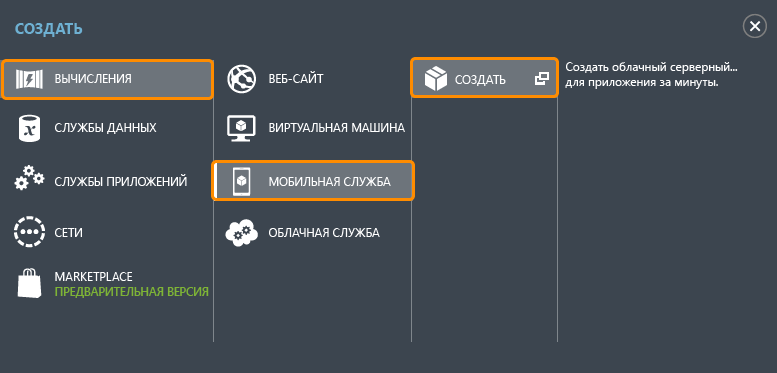
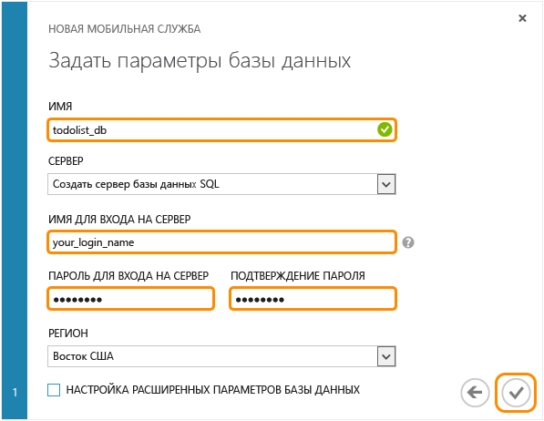

Выполните следующие действия для создания новой мобильной службы.

1.	Выполните вход в [портал управления](https://manage.windowsazure.com/). В нижней части области навигации щелкните **+СОЗДАТЬ**. Разверните окна **Среда выполнения приложений** и **Мобильная услуга**, нажмите **Создать**.
	
	

	Откроется диалоговое окно **Создать мобильную службу**.

2.	На странице **Создать мобильную службу** выберите **Создать бесплатную базу данных SQL 20 МБ**, выберите среду выполнения **.NET**, а затем введите имя поддомена для новой мобильной службы в текстовом поле **URL-адрес**. Нажмите кнопку со стрелкой вправо, чтобы перейти к следующей странице.
	
	

	Откроется страница **Указать параметры базы данных**.

	> [AZURE.NOTE]В рамках данного учебника вы создадите новый экземпляр базы данных SQL и сервер. Эту новую базу данных можно потом использовать и администрировать ее, как и любой другой экземпляр базы данных SQL. Если в этом регионе у вас уже имеется база данных в качестве новой мобильной службы, вы можете выбрать **Использовать существующую базу данных** и выбрать эту базу данных. Из-за затрат на увеличение пропускной способности и более длительных задержек не рекомендуется использовать базу данных в другом регионе.

3.	В поле **Имя** введите имя новой базы данных, затем введите **Имя для входа в систему**, которое является именем входа администратора для нового сервера базы данных SQL, введите и подтвердите пароль и нажмите кнопку "Проверить", чтобы завершить процесс. 

Вы создали новую мобильную службу, которая может использоваться вашими мобильными приложениями.

<!---HONumber=July15_HO2-->