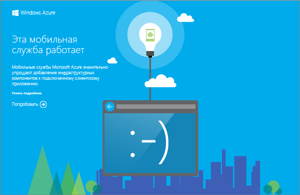


Загруженный проект мобильной службы позволяет запустить эту службу прямо на локальном компьютере или в виртуальной машине. Это упрощает отладку кода службы перед их публикацией в Azure.

В этом разделе будет протестирована работа нового приложения с мобильной службой, запущенной локально.

1. Перейдите в расположение, где были сохранены сжатые файлы проекта, извлеките файлы на компьютере и откройте файл решения в Visual Studio.

2. Нажмите клавишу **F5** для повторной сборки проекта, после чего запустите мобильную службу в локальной среде.

	

	После успешного запуска мобильной службы отображается веб-страница.

3. В обозревателе решений Visual Studio щелкните правой кнопкой мыши проект клиентского приложения и выберите пункт **Назначить запускаемым проектом**, после чего нажмите клавишу **F5** для повторной сборки проекта и запуска приложения.

	При этом запускается приложение, которое подключается к локальному экземпляру мобильной службы.	

4. В приложении в поле **Вставить в TodoItem** введите содержательный текст, например _Работа с учебником_, и нажмите кнопку **Сохранить**.

	Этот код отправляет в локальную мобильную службу запрос POST. Данные из запроса вставляются в таблицу TodoItem. Элементы, хранящиеся в таблице, возвращаются мобильной службой, а данные отображаются во втором столбце в приложении.<!--HONumber=42-->
