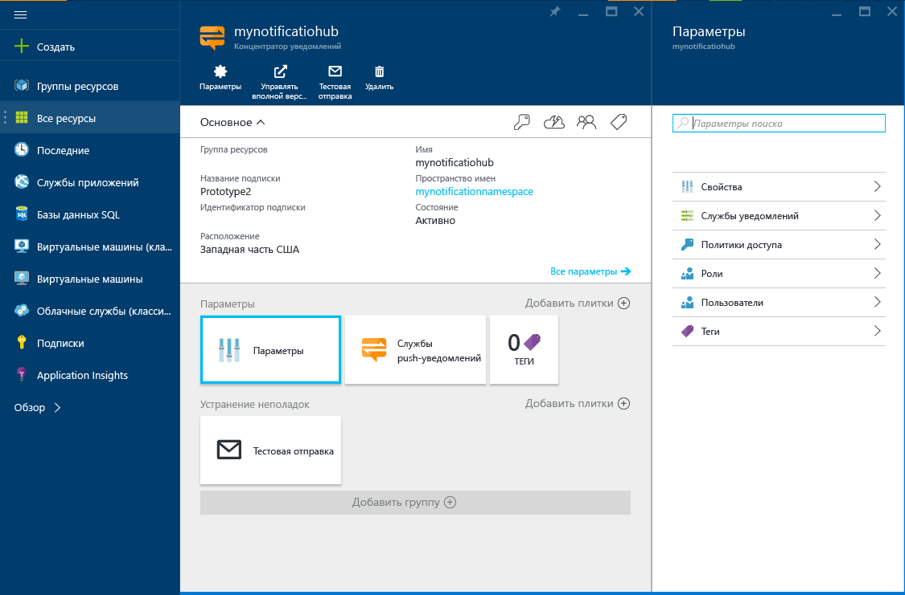

1. Выполните вход на [портал Azure](https://portal.azure.com).

2. Выберите **Создать** > **Интернет + мобильные устройства** > **Концентратор уведомлений**.
   
      
      
3. В поле **Центр уведомлений** введите уникальное имя. Выберите **регион**, **подписку** и **группу ресурсов** (если она уже создана). 
   
    Если у вас уже есть пространство имен служебной шины, в котором требуется создать концентратор, сделайте следующее:

    а. В области **Пространство имен** выберите ссылку **Выбрать существующее**. 
   
    b. Нажмите кнопку **Создать**.

    Если у вас нет пространства имен служебной шины, можно использовать имя по умолчанию. Оно создается на основе имени концентратора (если имя пространства имен доступно).
   
      

    Когда вы создадите пространство имен и центр уведомлений, откроется портал Azure. 
   
      

4. Выберите **Параметры** > **Политики доступа**. Запишите две строки подключения, которые отобразятся. Они понадобятся вам для дальнейшей обработки push-уведомлений.
   
      

