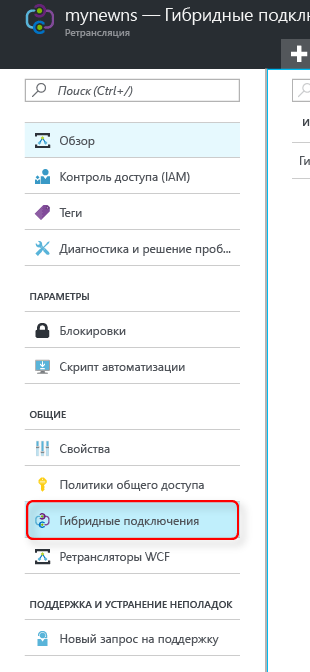
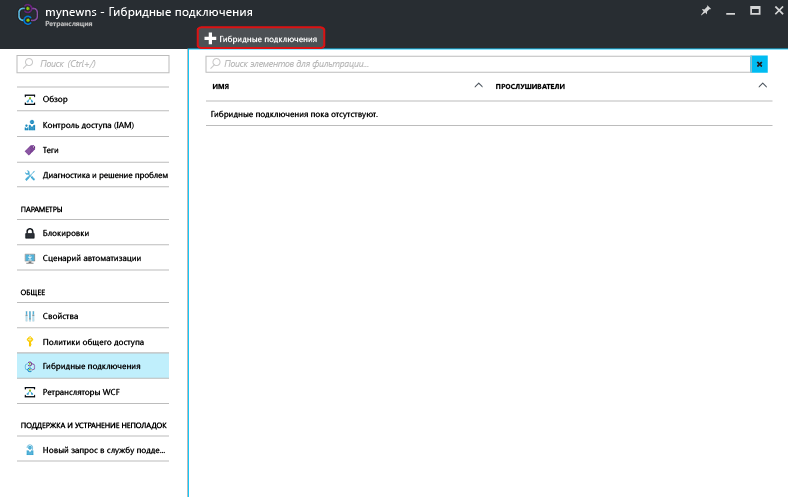
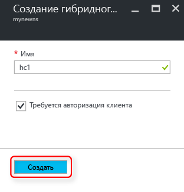

Убедитесь, что вы уже создали пространство имен ретранслятора, как показано [здесь][namespace-how-to].

1. Войдите на [портал Azure](https://portal.azure.com).
2. На портале в области навигации слева щелкните **Все ресурсы**.
3. Щелкните пространство имен, в котором вы хотите создать гибридное подключение. В нашем примере это **mynewns**.
   
4. В колонке **Relay namespace** (Пространство имен ретранслятора) щелкните **Гибридные подключения**.

    

5. В окне обзора пространств имен щелкните **+ Гибридное подключение**
   
    
5. Укажите **имя гибридного подключения**, а для других параметров оставьте значения по умолчанию.
   
    
6. Нажмите кнопку **Создать** в нижней части диалогового окна.

[namespace-how-to]: ../articles/service-bus-relay/relay-create-namespace-portal.md 