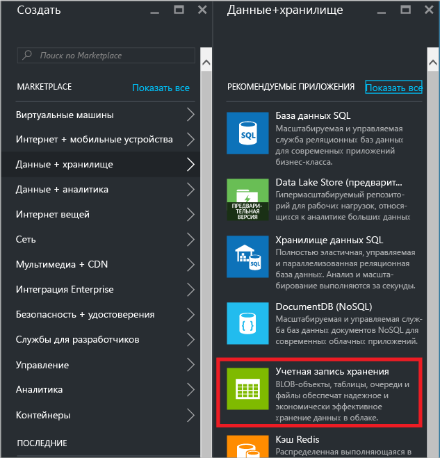
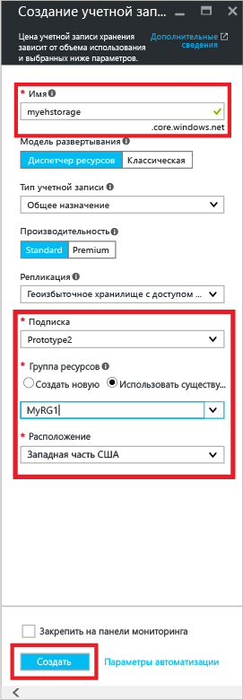
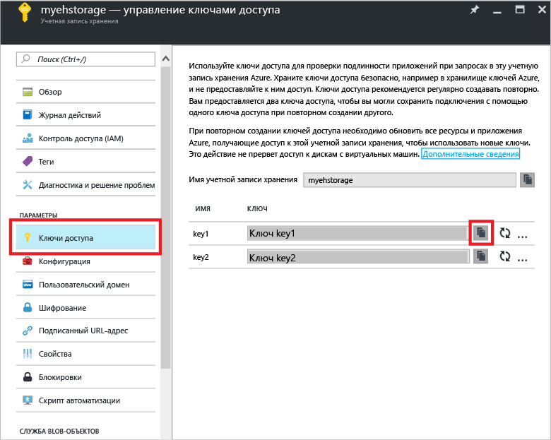
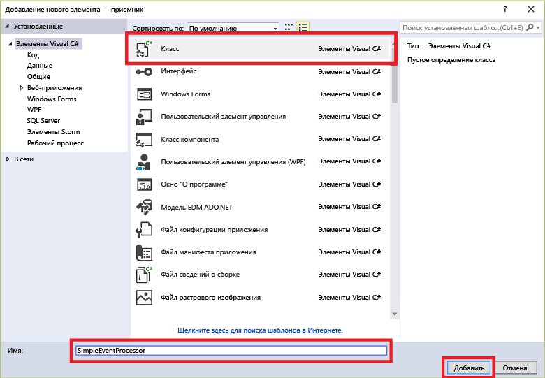

## Прием сообщений через EventProcessorHost

[EventProcessorHost][] представляет собой класс .NET, который упрощает прием событий от концентраторов событий путем управления постоянными контрольными точками и одновременно принимает сообщения от этих концентраторов событий в параллельном режиме. С помощью класса [EventProcessorHost][] можно разделить события между несколькими получателями даже в том случае, если они размещены в разных узлах. В этом примере показано, как использовать [EventProcessorHost][] для одного получателя. В примере [обработки масштабируемого события][] показано, как использовать [EventProcessorHost][] для нескольких получателей.

Для использования класса [EventProcessorHost][] необходимо настроить [учетную запись хранения Azure][].

1. Войдите на [портал Azure][] и щелкните **Создать** в левой верхней части экрана.

2. Щелкните **Данные+хранилище**, а затем щелкните **Учетная запись хранения**.

    

3. В колонке **Создание учетной записи хранилища** введите имя учетной записи хранилища. Выберите подписку Azure, группу ресурсов и расположение для создания ресурса. Затем щелкните **Создать**.

    

4. В списке учетных записей хранения выберите только что созданную учетную запись хранения.

5. В колонке учетной записи хранения выберите **Ключи доступа**. Скопируйте значение **key1**, чтобы использовать позже в этом руководстве.

	

4. Создайте в Visual Studio новый проект Visual C# для классических приложений с помощью шаблона проекта **Консольное приложение**. Присвойте проекту имя **Получатель**.

    

5. В обозревателе решений щелкните решение правой кнопкой мыши и выберите пункт **Управление пакетами NuGet для решения**.

6. Щелкните вкладку **Обзор** и выполните поиск `Microsoft Azure Service Bus Event Hub - EventProcessorHost`. Убедитесь, что имя проекта (**Receiver**) указано в поле **Версии**. Щелкните **Установить** и примите условия использования.

    

	Visual Studio скачает, установит и добавит ссылку на [пакет концентратора событий служебной шины Azure EventProcessorHost NuGet](https://www.nuget.org/packages/Microsoft.Azure.ServiceBus.EventProcessorHost) со всеми его зависимостями.

7. Щелкните правой кнопкой мыши проект **Получатель**, выберите пункт **Добавить**, а затем **Класс**. Присвойте новому классу имя **SimpleEventProcessor**, а затем нажмите кнопку **ОК**, чтобы создать класс.

	

8. Добавьте в начало файла SimpleEventProcessor.cs следующие инструкции:

	```
	using Microsoft.ServiceBus.Messaging;
	using System.Diagnostics;
	```

	Затем замените следующий код текстом класса:

	```
    class SimpleEventProcessor : IEventProcessor
	{
	    Stopwatch checkpointStopWatch;

	    async Task IEventProcessor.CloseAsync(PartitionContext context, CloseReason reason)
	    {
	        Console.WriteLine("Processor Shutting Down. Partition '{0}', Reason: '{1}'.", context.Lease.PartitionId, reason);
	        if (reason == CloseReason.Shutdown)
	        {
	            await context.CheckpointAsync();
	        }
	    }

	    Task IEventProcessor.OpenAsync(PartitionContext context)
	    {
	        Console.WriteLine("SimpleEventProcessor initialized.  Partition: '{0}', Offset: '{1}'", context.Lease.PartitionId, context.Lease.Offset);
	        this.checkpointStopWatch = new Stopwatch();
	        this.checkpointStopWatch.Start();
	        return Task.FromResult<object>(null);
	    }

	    async Task IEventProcessor.ProcessEventsAsync(PartitionContext context, IEnumerable<EventData> messages)
	    {
	        foreach (EventData eventData in messages)
	        {
	            string data = Encoding.UTF8.GetString(eventData.GetBytes());

	            Console.WriteLine(string.Format("Message received.  Partition: '{0}', Data: '{1}'",
	                context.Lease.PartitionId, data));
	        }

	        //Call checkpoint every 5 minutes, so that worker can resume processing from 5 minutes back if it restarts.
	        if (this.checkpointStopWatch.Elapsed > TimeSpan.FromMinutes(5))
            {
                await context.CheckpointAsync();
                this.checkpointStopWatch.Restart();
            }
	    }
	}
    ```

	Этот класс будет вызываться из **EventProcessorHost** для обработки событий, полученных от концентратора событий. Обратите внимание, что в классе `SimpleEventProcessor` используется контрольный таймер для периодического вызова метода контрольных точек в контексте **EventProcessorHost**. Это гарантирует, что в случае перезагрузки получателя будет потеряно не более пяти минут обработки.

9. Добавьте в класс **Program** в начале файла следующую инструкцию `using`.

	```
	using Microsoft.ServiceBus.Messaging;
	```

	Затем измените метод `Main` в классе `Program` следующим кодом. При этом укажите имя концентратора событий и сохраненную ранее строку подключения уровня пространства имен, а также учетную запись хранения и ключ, которые вы скопировали в предыдущих разделах.

    ```
	static void Main(string[] args)
    {
      string eventHubConnectionString = "{Event Hub connection string}";
      string eventHubName = "{Event Hub name}";
      string storageAccountName = "{storage account name}";
      string storageAccountKey = "{storage account key}";
      string storageConnectionString = string.Format("DefaultEndpointsProtocol=https;AccountName={0};AccountKey={1}", storageAccountName, storageAccountKey);

      string eventProcessorHostName = Guid.NewGuid().ToString();
      EventProcessorHost eventProcessorHost = new EventProcessorHost(eventProcessorHostName, eventHubName, EventHubConsumerGroup.DefaultGroupName, eventHubConnectionString, storageConnectionString);
      Console.WriteLine("Registering EventProcessor...");
      var options = new EventProcessorOptions();
      options.ExceptionReceived += (sender, e) => { Console.WriteLine(e.Exception); };
      eventProcessorHost.RegisterEventProcessorAsync<SimpleEventProcessor>(options).Wait();

      Console.WriteLine("Receiving. Press enter key to stop worker.");
      Console.ReadLine();
      eventProcessorHost.UnregisterEventProcessorAsync().Wait();
    }
	```

> [AZURE.NOTE] В данном учебнике используется один экземпляр [EventProcessorHost][]. Чтобы увеличить пропускную способность, рекомендуется запустить несколько экземпляров [EventProcessorHost][], как показано в примере [Обработка масштабированного события][]. В этом случае различные экземпляры автоматически координируются друг с другом для распределения нагрузки полученных событий. Если каждый из нескольких получателей должен обрабатывать *все* события, то необходимо использовать понятие **ConsumerGroup**. При получении события от разных компьютеров может оказаться полезным указать имена экземпляров [EventProcessorHost][] в компьютерах (или ролях), где они развернуты. Дополнительные сведения об этих темах см. в статьях [Общие сведения о концентраторах событий Azure][] и [Руководство по программированию концентраторов событий][].

<!-- Links -->
[Общие сведения о концентраторах событий Azure]: event-hubs-overview.md
[Руководство по программированию концентраторов событий]: event-hubs-programming-guide.md
[Обработка масштабированного события]: https://code.msdn.microsoft.com/Service-Bus-Event-Hub-45f43fc3
[обработки масштабируемого события]: https://code.msdn.microsoft.com/Service-Bus-Event-Hub-45f43fc3
[учетную запись хранения Azure]: ../storage/storage-create-storage-account.md
[EventProcessorHost]: http://msdn.microsoft.com/library/azure/microsoft.servicebus.messaging.eventprocessorhost(v=azure.95).aspx
[портал Azure]: https://portal.azure.com

<!---HONumber=AcomDC_0921_2016-->