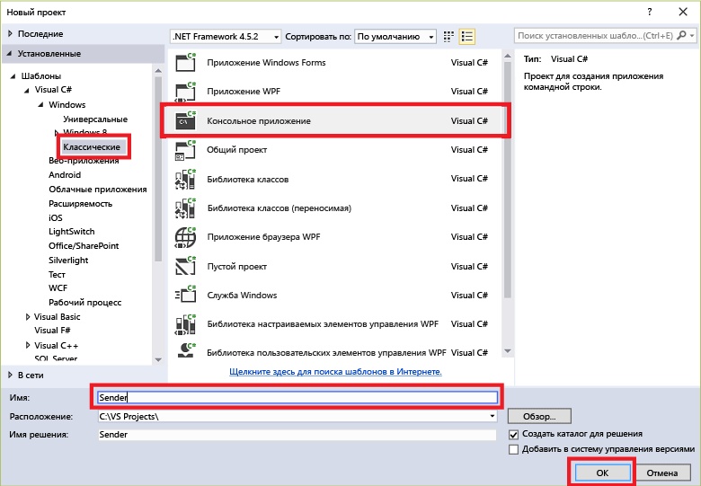

## Отправка сообщений в центры событий

В этом разделе создается консольное приложение Windows для отправки событий в концентратор событий.

1. Создайте в Visual Studio новый проект Visual C# для классических приложений с помощью шаблона проекта **Консольное приложение**. Назовите проект **Sender**.

	

2. В обозревателе решений щелкните решение правой кнопкой мыши и выберите пункт **Управление пакетами NuGet для решения**.

3. Щелкните вкладку **Обзор** и выполните поиск по строке `Microsoft Azure Service Bus`. Убедитесь, что имя проекта (**Sender**) указано в поле **Версии**. Щелкните **Установить** и примите условия использования.

	

	Visual Studio скачает, установит и добавит ссылку на [пакет NuGet библиотеки служебной шины Azure](https://www.nuget.org/packages/WindowsAzure.ServiceBus).

4. Добавьте следующие инструкции `using` в начало файла **Program.cs**:

	```
	using System.Threading;
	using Microsoft.ServiceBus.Messaging;
	```

5. Добавьте в класс **Program** приведенные ниже поля и укажите в качестве значений имя концентратора событий, созданного в предыдущем разделе, и сохраненную ранее строку подключения уровня пространства имен.

	```
	static string eventHubName = "{Event Hub name}";
	static string connectionString = "{send connection string}";
	```

6. Добавьте следующий метод в класс **Program**.

	```
	static void SendingRandomMessages()
	{
	    var eventHubClient = EventHubClient.CreateFromConnectionString(connectionString, eventHubName);
	    while (true)
	    {
	        try
	        {
	            var message = Guid.NewGuid().ToString();
	            Console.WriteLine("{0} > Sending message: {1}", DateTime.Now, message);
	            eventHubClient.Send(new EventData(Encoding.UTF8.GetBytes(message)));
	        }
	        catch (Exception exception)
	        {
	            Console.ForegroundColor = ConsoleColor.Red;
	            Console.WriteLine("{0} > Exception: {1}", DateTime.Now, exception.Message);
	            Console.ResetColor();
	        }

	        Thread.Sleep(200);
	    }
	}
	```

	Этот метод постоянно отправляет события в концентратор событий с задержкой 200 мс.

7. Наконец, добавьте следующие строки в метод **Main**:

	```
	Console.WriteLine("Press Ctrl-C to stop the sender process");
	Console.WriteLine("Press Enter to start now");
	Console.ReadLine();
	SendingRandomMessages();
	```

<!---HONumber=AcomDC_0921_2016-->