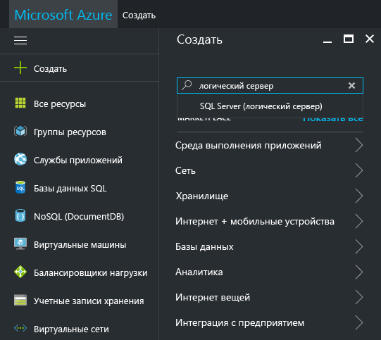
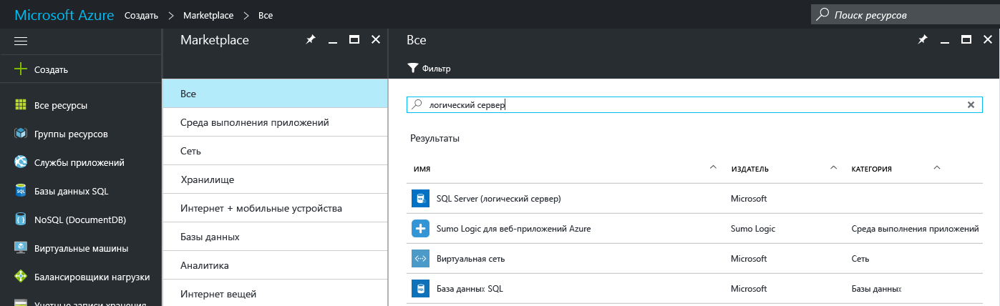
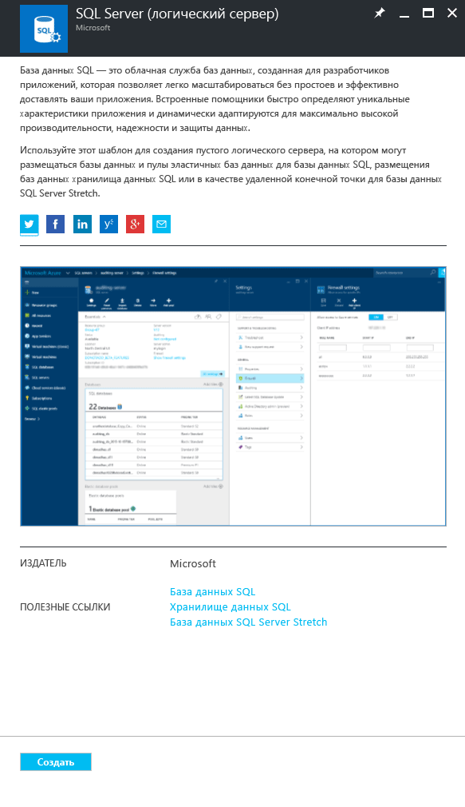
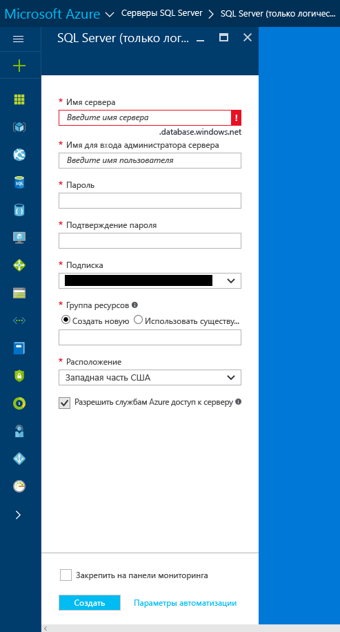
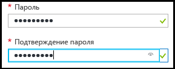
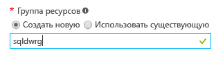

### Создание логического сервера SQL Server на портале Azure

1. Щелкните **Создать**, выполните поиск по запросу **логический сервер** и нажмите клавишу **ВВОД**.

    
2. Выберите **SQL Server (логический сервер)**. 

    
  
3. Щелкните **Создать**, чтобы открыть колонку создания логического сервера SQL Server.

   <kbd> </kbd> <kbd> </kbd>
  
3. В поле "Имя сервера" сервера SQL Server (логический сервер) введите допустимое имя для нового логического сервера. Зеленый флажок указывает, что выбрано допустимое имя.
    
    

    > [!IMPORTANT]
    > Полным именем нового сервера будет <имя_вашего_сервера>.database.windows.net.
    >
    
4. В текстовом поле "Имя входа администратора сервера" укажите имя пользователя, которое будет использоваться сервером при проверке подлинности SQL Server. Это имя называется именем субъекта сервера. Зеленый флажок указывает, что выбрано допустимое имя.
    
    
5. В полях **Пароль** и **Подтверждение пароля** укажите пароль для входа в учетную запись субъекта сервера. Зеленый флажок указывает, что выбран допустимый пароль.
    
    
6. Выберите подписку, в которой у вас есть разрешение на создание объектов.

    
7. Над полем "Группа ресурсов" установите переключатель **Создать новую**, а затем в текстовом поле введите допустимое имя новой группы ресурсов. Также можно использовать существующую группу, если она уже создана. Зеленый флажок указывает, что выбрано допустимое имя.

    

8. В списке **Расположение** выберите центр обработки данных, соответствующий вашему расположению, например "Восточная Австралия".
    
    
    
    > [!TIP]
    > Параметр **Разрешить службам Azure доступ к серверу** невозможно изменить в этой колонке. Его можно изменить в колонке брандмауэра сервера. Дополнительные сведения см. в статье [Руководство по базам данных SQL: создание учетных записей пользователей базы данных SQL для доступа к базе данных и управления ею с помощью портала Azure](../articles/sql-database/sql-database-manage-servers-portal.md).
    >
    
9. Щелкните **Создать**.

    

