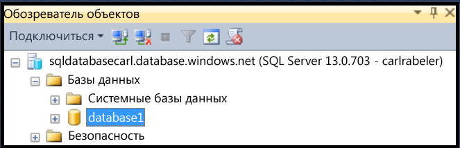
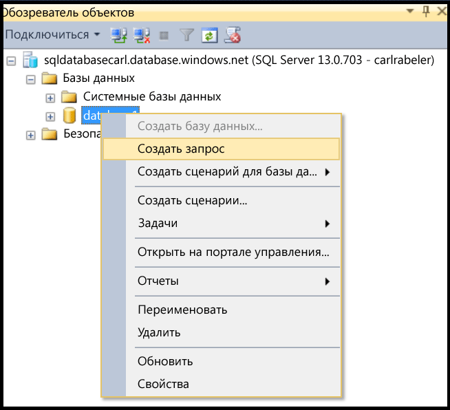
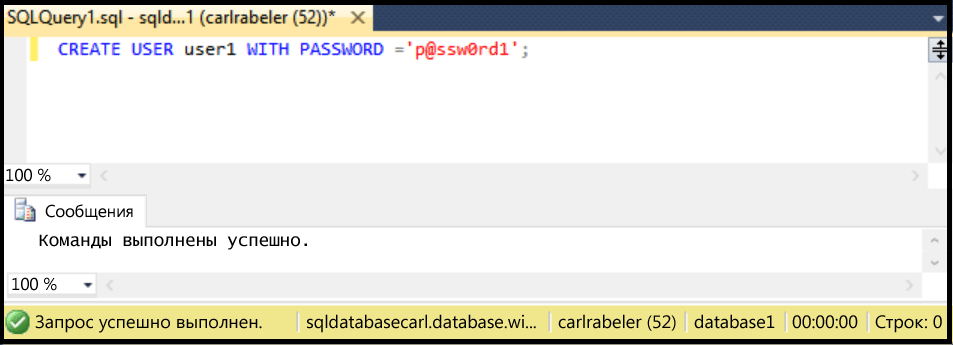

## Создание нового пользователя базы данных с помощью SSMS

Для выполнения приведенных ниже инструкций требуется: установленная среда SSMS, подключение к базе данных SQL в обозревателе объектов, а также подключение к логическому серверу базы данных SQL в качестве администратора-участника уровня сервера или с помощью учетной записью пользователя с разрешениями на создание пользователя. Кроме того, должна существовать пользовательская база данных, в рамках которой вы хотите создать учетную запись пользователя.

1. В обозревателе объектов разверните узел базы данных и выберите базу данных, в которой вы хотите создать учетную запись.

     

2. Щелкните правой кнопкой мыши базу данных и выберите пункт **Запрос**.

     

3. В окне запроса измените и выполните следующую инструкцию Transact-SQL, чтобы создать пользователя в базе данных.

    ```CREATE USER user1 WITH PASSWORD ='p@ssw0rd1';

     

<!---HONumber=AcomDC_0420_2016-->