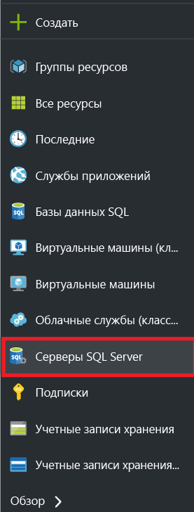
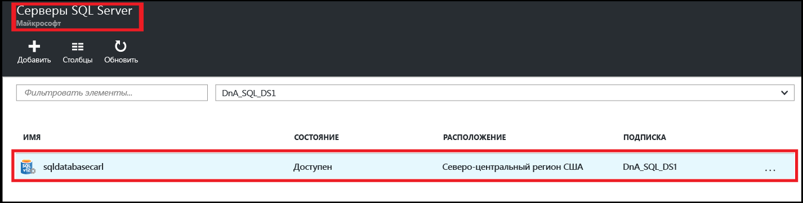
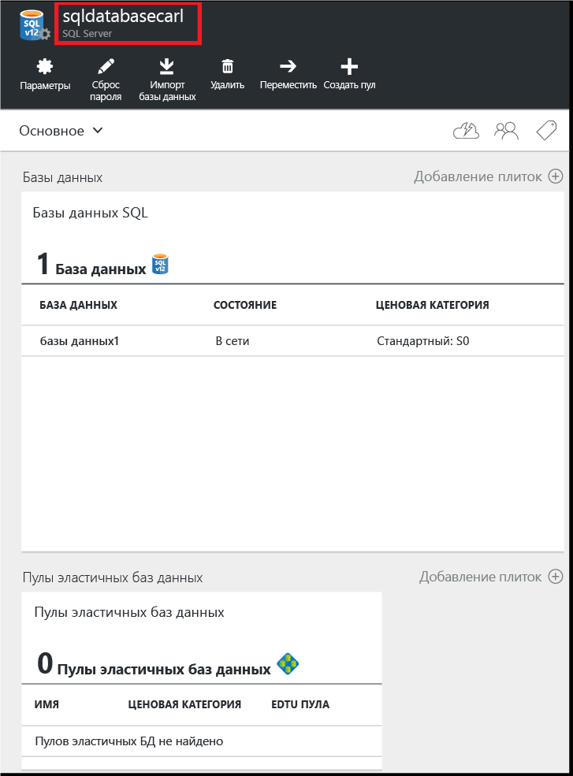
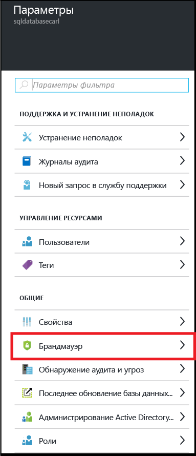
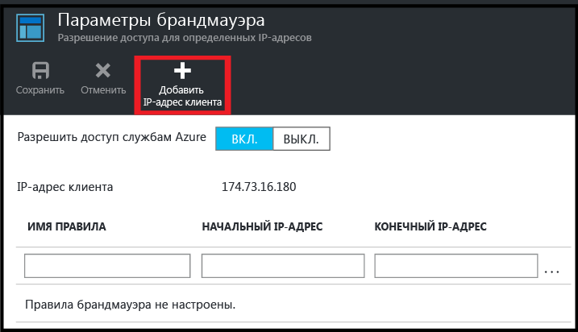
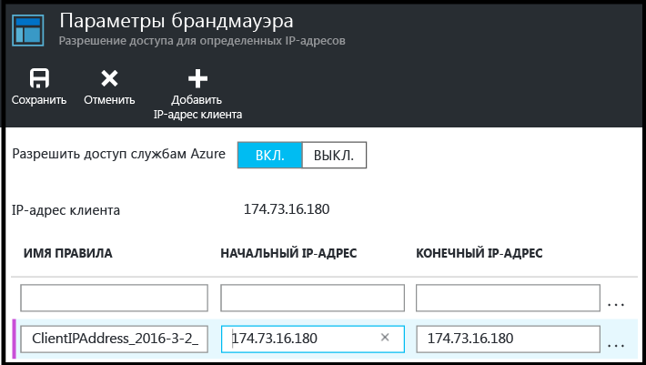

<!--
includes/sql-database-create-new-server-firewall-portal.md

Latest Freshness check:  2016-04-11 , carlrab.

As of circa 2016-04-11, the following topics might include this include:
articles/sql-database/sql-database-get-started-tutorial.md
articles/sql-database/sql-database-configure-firewall-settings

-->
## Создание брандмауэра уровня сервера SQL Azure

В этой статье описано, как на портале Azure создать правило брандмауэра уровня сервера, разрешающее подключения с отдельного IP-адреса (клиентского компьютера) или всего диапазона IP-адресов логического сервера SQL.

1. Если вы еще этого не сделали, подключитесь к [порталу Azure](http://portal.azure.com).
2. В колонке по умолчанию щелкните **SQL Server**.

  	

2. В колонке "SQL Server" выберите сервер SQL, на котором необходимо создать правило брандмауэра.

 	
           
3. Проверьте свойства сервера.

 	
      
4. В колонке параметров щелкните **Брандмауэр**.

 	
    
5. Щелкните **Добавить IP-адрес клиента**, чтобы система Azure создала правило для IP-адреса ваше клиента.

      

6. При необходимости щелкните IP-адрес, который был добавлен, чтобы изменить адрес брандмауэра и разрешить доступ с диапазона IP-адресов.

      
    
7. Щелкните **Сохранить**, чтобы создать правило в брандмауэре сервера.

     

	>[AZURE.IMPORTANT] Ваш IP-адрес клиента, скорее всего, будет периодически меняться; в таком случае вы не сможете получить доступ к серверу, пока не создадите новое правило брандмауэра. Вы можете узнать свой IP-адрес с помощью службы [Bing](http://www.bing.com/search?q=my%20ip%20address). Затем добавьте один IP-адрес или диапазон IP-адресов. Подробные сведения см. в разделе [Управление существующими правилами брандмауэра с помощью портала Azure](sql-database-configure-firewall-settings.md#manage-existing-server-level-firewall-rules-through-the-azure-portal).
