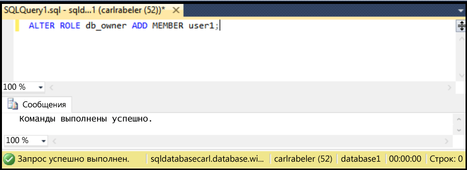

## <a name="grant-new-database-user-dbowner-permissions"></a>Предоставление новому пользователю базы данных разрешений db_owner
Чтобы предоставить существующему пользователю базы данных разрешения db_owner, выполните описанные ниже действия.

Для выполнения этих действий требуется: подключение к базе данных SQL в обозревателе объектов с помощью SSMS, а также подключение к логическому серверу базы данных SQL в качестве администратора-участника уровня сервера или с помощью учетной записи пользователя с разрешениями предоставлять пользователям разрешения. 

1. В обозревателе объектов разверните узел базы данных и выберите базу данных с пользователем, которому вы хотите предоставить разрешения dbo.
   
     
2. Щелкните правой кнопкой мыши выбранную базу и выберите пункт **Запрос**.
   
     
3. В окне запроса измените и выполните следующую инструкцию Transact-SQL, чтобы предоставить разрешения dbo указанному пользователю. 
   
    '''ALTER ROLE db_owner ADD MEMBER user1;
    ```
   
     


<!--HONumber=Nov16_HO2-->


