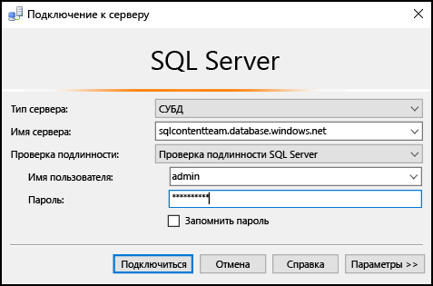
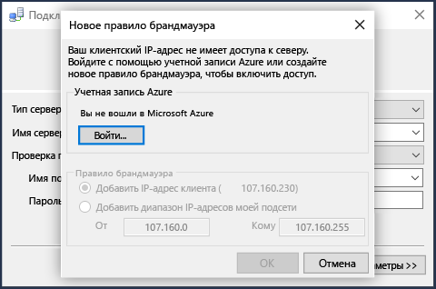
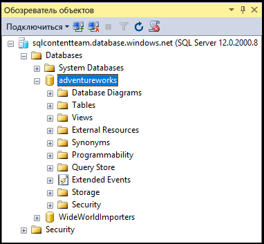

## Подключение к базе данных SQL Azure с использованием проверки подлинности SQL Server

Ниже показано, как подключиться к SQL Server и базе данных Azure с помощью SSMS. Если у вас нет сервера и базы данных, см. статью [Руководство по базам данных SQL: создание базы данных SQL за несколько минут с помощью портала Azure](../articles/sql-database/sql-database-get-started.md).

1. Чтобы запустить SSMS, введите в поле поиска Windows текст **Microsoft SQL Server Management Studio** и выберите классическое приложение.

2. В окне **Подключение к серверу** укажите следующие сведения (если SSMS уже выполняется, щелкните **Подключиться > Ядро СУБД**, чтобы открыть окно **подключения к серверу**):

 - **Тип сервера**: по умолчанию здесь указан модуль базы данных; не изменяйте это значение.
 - **Имя сервера**: введите полное имя сервера, где размещена ваша база данных SQL Azure, в формате *<имя\_сервера>*.**database.windows.net**.
 - **Тип проверки подлинности**: в этой статье показано, как установить подключение с помощью **проверки подлинности SQL Server**. Дополнительные сведения о подключении с помощью Azure Active Directory см. в разделах с описанием подключения с помощью [встроенной проверки подлинности Active Directory](../articles/sql-database/sql-database-aad-authentication.md#connect-using-active-directory-integrated-authentication), [проверки пароля Active Directory](../articles/sql-database/sql-database-aad-authentication.md#connect-using-active-directory-password-authentication) и [универсальной проверки подлинности Active Directory](../articles/sql-database/sql-database-ssms-mfa-authentication.md).
 - **Имя пользователя**: введите имя пользователя с доступом к базе данных на сервере (например, *администратора сервера*, созданного одновременно с сервером).
 - **Пароль**: введите пароль для указанного пользователя (например, *пароль*, настроенный при создании сервера).
   
       

3. Щелкните **Подключить**.
 
4. По умолчанию [правила брандмауэра](../articles/sql-database/sql-database-firewall-configure.md) для новых серверов не определены, поэтому для клиентов возможность подключения изначально будет заблокирована. Если правило брандмауэра, которое разрешает определенный IP-адрес для подключения, еще не настроено для сервера, SSMS предложит создать правило брандмауэра серверного уровня.

    Щелкните **Войти** и создайте правило брандмауэра серверного уровня. В противном случае попросите администратора Azure создать такое правило.
 
       
 

5. После успешного подключения к базе данных SQL Azure откроется **обозреватель объектов**. Теперь вы можете обращаться к базе данных, чтобы [выполнять административные задачи и запрашивать данные](../articles/sql-database/sql-database-manage-azure-ssms.md).
 
     
 
     
## Устранение сбоев подключения

Самые распространенные причины сбоев подключения — ошибки в имени сервера и проблемы с сетевым подключением. Помните, что <*имя\_сервера*> — это имя сервера, а не базы данных. Следовательно, вам нужно ввести полное имя сервера: `<servername>.database.windows.net`

Кроме того, имя пользователя и пароль нужно вводить без опечаток и лишних пробелов (для паролей регистр учитывается, а для имен пользователей — нет).

Можно также явно задать протокол и номер порта с именем сервера: `tcp:servername.database.windows.net,1433`

Ошибки подключения и долгое время ожидания также могут возникать из-за проблем с сетевым подключением. Если имя сервера, учетные данные и правила брандмауэра указаны правильно, иногда достаточно просто повторить попытку подключения.

<!---HONumber=AcomDC_0824_2016-->