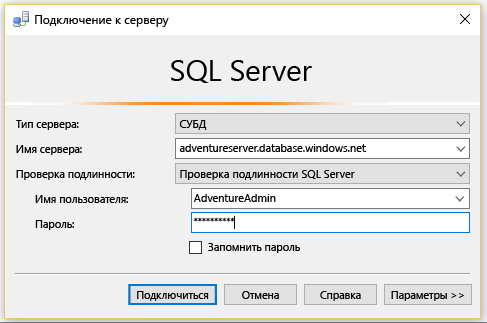
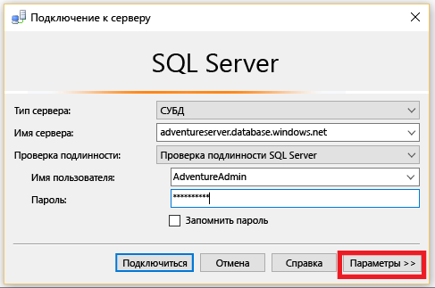
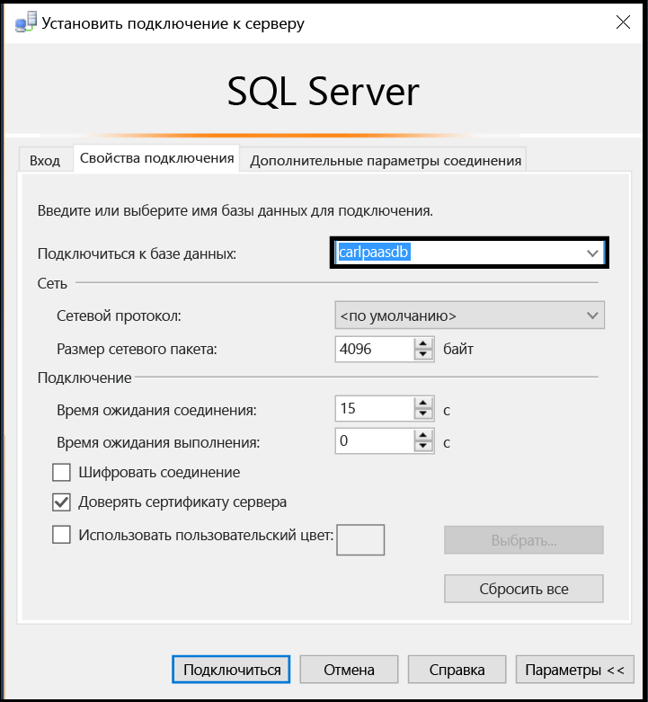
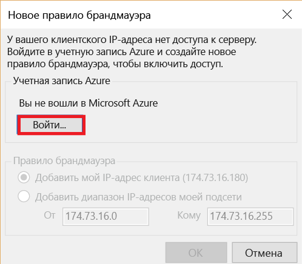
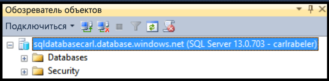

## Подключение пользователя к базе данных SQL Azure

Чтобы подключиться к базе данных SQL Azure в среде SSMS с правами пользователя, выполните описанные ниже действия.

1. Введите в поле поиска Windows текст "Microsoft SQL Server Management Studio" и выберите классическое приложение, чтобы запустить SSMS.

2. В окне подключения к серверу введите следующие значения.

- **Тип сервера**: по умолчанию здесь указан компонент "database engine", не изменяйте это значение.
 - **Имя сервера**: введите здесь имя сервера, на котором находится ваша база данных SQL, в формате *<имя\_сервера>*.**database.windows.net**.
 - **Тип проверки подлинности**: если вы только знакомитесь с системой, выберите проверку подлинности SQL. Если вы ранее активировали Active Directory для логического сервера базы данных SQL, здесь можно выбрать проверку пароля Active Directory или встроенную проверку подлинности Active Directory.
 - **Имя пользователя**: если вы выбрали проверку подлинности SQL или проверку пароля Active Directory, введите имя пользователя с доступом к базе данных на сервере.
 - **Пароль**: если вы выбрали проверку подлинности SQL или проверку пароля Active Directory, введите пароль для указанного пользователя.
   
       

3. Щелкните **Параметры**, чтобы указать нужную базу данных.

      
 
4. В поле **Подключение к базе данных** выберите базу данных, к которой хотите подключиться.

     

5. Щелкните **Подключить**.
 
6. Если IP-адрес вашего клиента не имеет доступа к логическому серверу базы данных SQL, вам будет предложено войти в учетную запись Azure и создать правило брандмауэра на уровне сервера. Если вы являетесь администратором подписки Azure, щелкните **Вход** для создания правила брандмауэра на уровне сервера. В противном случае попросите администратора Azure создать правило брандмауэра на уровне сервера или на уровне базы данных в той базе данных, которая вам нужна.
 
      
 
7. Если вы можете получить доступ к выбранной базе данных с помощью своих учетных данных, откроется обозреватель объектов для выполнения административных задач или просмотра данных. Доступные операции будут зависеть от разрешений учетной записи.
  
      
      
 
## Устранение сбоев подключения

Наиболее распространенными причинами сбоев подключения являются ошибки при вводе имени сервера (*<servername>* — это имя логического сервера, а не базы данных), имени пользователя или пароля, а также запрет подключения к серверу из-за политик безопасности.

<!---HONumber=AcomDC_0629_2016-->