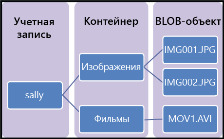

Хранилище BLOB-объектов Azure — это решение корпорации Майкрософт для хранения объектов в облаке. Хранилище BLOB-объектов оптимизировано для хранения больших объемов неструктурированных данных, например текстовых или двоичных данных.

Хранилище BLOB-объектов идеально подходит для следующих целей:

* Обслуживание изображений или документов непосредственно в браузере.
* Хранение файлов для распределенного доступа.
* Потоковая передача видео и аудио.
* Запись в файлы журнала.
* Хранение резервных копий и восстановление данных, аварийное восстановление и архивация.
* Хранение данных для анализа локальной службой или службой, размещенной в Azure.

Доступ к объектам в хранилище BLOB-объектов можно получить в любой точке мира по протоколу HTTP или HTTPS. Пользователи и клиентские приложения могут обращаться к большим двоичным объектам с помощью URL-адресов, [REST API службы хранилища Azure](https://docs.microsoft.com/rest/api/storageservices/blob-service-rest-api), [Azure PowerShell](https://docs.microsoft.com/powershell/module/azure.storage), [Azure CLI](https://docs.microsoft.com/cli/azure/storage) или клиентской библиотеки службы хранилища Azure. Клиентские библиотеки службы хранилища доступны для различных языков, в том числе [.NET](https://docs.microsoft.com/dotnet/api/overview/azure/storage/client), [Java](https://docs.microsoft.com/java/api/overview/azure/storage/client), [Node.js](http://azure.github.io/azure-storage-node), [Python](https://azure-storage.readthedocs.io/en/latest/index.html), [PHP](http://azure.github.io/azure-storage-php/) и [Ruby](http://azure.github.io/azure-storage-ruby).

## Основные понятия службы BLOB-объектов

Хранилище больших двоичных объектов предоставляет три ресурса: учетную запись хранения, контейнеры в этой учетной записи и большие двоичные объекты в контейнере. На следующей схеме показана связь между этими ресурсами.

### Учетная запись хранения

Весь доступ к объектам данных в службе хранилища Azure осуществляется с помощью учетной записи хранения. Дополнительные сведения см. в статье [Об учетных записях хранения Azure](../articles/storage/common/storage-create-storage-account.md?toc=%2fazure%2fstorage%2fblobs%2ftoc.json).

### Контейнер

Контейнер упорядочивает набор больших двоичных объектов, как папка в файловой системе. Все большие двоичные объекты размещаются в контейнере. Учетная запись хранения может содержать неограниченное количество контейнеров. В каждом контейнере может храниться неограниченное количество больших двоичных объектов. Учтите, что все знаки в имени контейнера должны быть строчными.

### BLOB-объект
 
В службе хранилища Azure доступны три типа больших двоичных объектов: блочные, добавочные и [страничные](../articles/storage/blobs/storage-blob-pageblob-overview.md) (используются для файлов VHD).

* Блочные большие двоичные объекты хранят текст и двоичные данные объемом до 4,7 ТБ. Блочные большие двоичные объекты состоят из блоков данных, которыми можно управлять отдельно.
* Добавочные большие двоичные объекты состоят из блоков, как и блочные, но оптимизированы для операций добавления. Добавочные большие двоичные объекты идеально подходят для таких сценариев, как сбор данных журналов из виртуальных машин.
* Страничные большие двоичные объекты используются для хранения файлов произвольного доступа объемом до 8 ТБ. Они предназначены для файлов VHD, которые поддерживают виртуальные машины.

Все большие двоичные объекты размещаются в контейнере. Контейнер похож на папку в файловой системе. После этого большие двоичные объекты можно упорядочить в виртуальные каталоги для просмотра в виде файловой системы. 

При использовании очень больших наборов данных, когда из-за ограничений сети просто невозможно отправить данные в хранилище BLOB-объектов или скачать их из него, можно передать набор жестких дисков в корпорацию Майкрософт для импорта или экспорта данных непосредственно в центре обработки данных. Дополнительную информацию см. в статье [Использование службы импорта и экспорта Azure для передачи данных в хранилище BLOB-объектов](../articles/storage/common/storage-import-export-service.md).
  
Дополнительные сведения об именовании контейнеров и больших двоичных объектов см. в статье, посвященной [именованию контейнеров, больших двоичных объектов и метаданных, а также создание ссылок на них](/rest/api/storageservices/Naming-and-Referencing-Containers--Blobs--and-Metadata).
