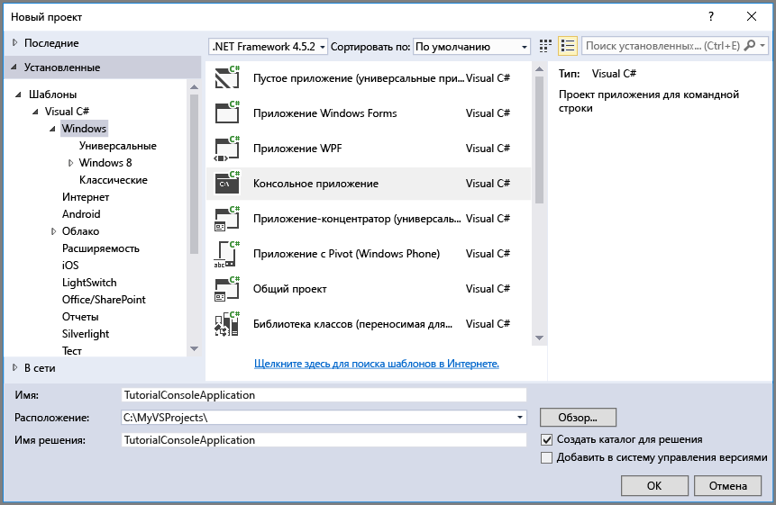

## <a name="set-up-your-development-environment"></a>Настройка среды разработки
Теперь настройте среду разработки в Visual Studio для работы с примерами кода из этого руководства.

### <a name="create-a-windows-console-application-project"></a>Создание нового проекта консольного приложения Windows
В Visual Studio создайте новое консольное приложение Windows. Ниже показано, как создать консольное приложение в Visual Studio 2017 г. Эти же действия можно выполнить и в других версиях Visual Studio.

1. Выберите **Файл** > **Создать** > **Проект**.
2. Выберите **Установлено** > **Шаблоны** > **Visual C#** > **Классический рабочий стол Windows**.
3. Выберите **Консольное приложение (.NET Framework)**.
4. В поле **Имя** введите имя приложения.
5. Нажмите кнопку **ОК**.



Все примеры кода из этого руководства можно добавить в метод `Main()` в файле `Program.cs` консольного приложения.

Вы можете использовать клиентскую библиотеку службы хранилища Azure в любом приложении .NET, в том числе в облачной службе Azure, веб-приложении Azure, классическом или мобильном приложении. Для упрощения в этом руководстве мы будем использовать консольное приложение.

### <a name="use-nuget-to-install-the-required-packages"></a>Установка необходимых пакетов с помощью NuGet
Для работы с этим руководством вам нужно указать в проекте два пакета:

* [Клиентская библиотека службы хранилища Microsoft Azure для .NET](https://www.nuget.org/packages/WindowsAzure.Storage/)— этот пакет предоставляет программный доступ к ресурсам данных в вашей учетной записи хранения.
* [Библиотека Microsoft Azure Configuration Manager для .NET](https://www.nuget.org/packages/Microsoft.WindowsAzure.ConfigurationManager/) — этот пакет предоставляет класс для анализа строки подключения в файле конфигурации независимо от среды выполнения приложения.

Вы можете использовать NuGet для установки обоих пакетов. Выполните следующие действия.

1. Щелкните правой кнопкой мыши проект в **обозревателе решений** и выберите **Управление пакетами NuGet**.
2. Выполните в Интернете поиск по запросу "WindowsAzure.Storage" и нажмите кнопку **Установить**, чтобы установить клиентскую библиотеку службы хранилища и зависимые компоненты.
3. Выполните поиск в Интернете по запросу "WindowsAzure.ConfigurationManager" и нажмите кнопку **Установить**, чтобы установить диспетчер конфигураций Azure.

> [!NOTE]
> Клиентская библиотека службы хранилища также доступна в [пакете Azure SDK для .NET](https://azure.microsoft.com/downloads/). Но мы рекомендуем также установить клиентскую библиотеку службы хранилища из NuGet, чтобы всегда иметь ее последнюю версию.
> 
> Зависимости ODataLib в клиентской библиотеке хранения для .NET разрешаются с помощью пакетов ODataLib, доступных в NuGet, а не в службах данных WCF. Библиотеки ODataLib можно скачать напрямую или указать на них ссылку в проекте через NuGet. К специальным пакетам ODataLib, используемым клиентскими библиотеками хранения, относятся [OData](http://nuget.org/packages/Microsoft.Data.OData/), [Edm](http://nuget.org/packages/Microsoft.Data.Edm/) и [Spatial](http://nuget.org/packages/System.Spatial/). Хотя эти библиотеки используются классами хранилища таблиц Azure, они являются обязательными зависимостями для программирования с использованием клиентской библиотеки хранения.
> 
> 

### <a name="determine-your-target-environment"></a>Определение целевой среды
Примеры из этого руководства можно выполнять в двух средах.

* Вы можете выполнить код в учетной записи хранения Azure в облаке. 
* Вы можете выполнить код в эмуляторе хранения Azure. Эмулятор хранения — это локальная среда, эмулирующая учетную запись хранения Azure в облаке. Эмулятор можно использовать как бесплатный вариант для тестирования и отладки кода, пока приложение находится на стадии разработки. Эмулятор использует известную учетную запись и ключ. Дополнительные сведения см. в руководстве по [использованию эмулятора хранения Azure для разработки и тестирования](../articles/storage/common/storage-use-emulator.md).

Выбрав учетную запись хранения в облаке, скопируйте первичный ключ доступа к этой учетной записи хранения с портала Azure. Дополнительные сведения см. в разделе [Просмотр и копирование ключей доступа к хранилищу](../articles/storage/common/storage-create-storage-account.md#view-and-copy-storage-access-keys).

> [!NOTE]
> Вы можете указать эмулятор хранения, чтобы избежать затрат, связанных с хранилищем Azure. Однако если вы выберете учетную запись хранения Azure в облаке, затраты на выполнение заданий в учебнике будут незначительны.
> 
> 

### <a name="configure-your-storage-connection-string"></a>Настройка строки подключения хранилища
Библиотека клиента хранилища Azure для .NET поддерживает использование строки подключения для настройки конечных точек и учетных данных для доступа к службам хранилища. Строку подключения хранилища рекомендуется хранить в файле конфигурации. 

Дополнительные сведения о строках подключения см. в руководстве по [настройке строк подключения службы хранилища Azure](../articles/storage/common/storage-configure-connection-string.md).

> [!NOTE]
> Ключ учетной записи хранения похож на корневой пароль для вашей учетной записи хранения. Не забудьте защитить ключ учетной записи хранения. Не сообщайте его другим пользователям, не определяйте его в коде и не храните его в текстовом файле, доступном другим пользователям. Повторно создайте ключ с помощью портала Azure, если вы считаете, что он мог быть скомпрометирован.
> 
> 

Чтобы настроить строку подключения, откройте файл `app.config` в обозревателе решений Visual Studio. Добавьте содержимое элемента `<appSettings>` , показанное ниже. Замените `account-name` именем своей учетной записи хранения, а `account-key` — ключом доступа своей учетной записи:

```xml
<configuration>
    <startup> 
        <supportedRuntime version="v4.0" sku=".NETFramework,Version=v4.5.2" />
    </startup>
    <appSettings>
        <add key="StorageConnectionString" value="DefaultEndpointsProtocol=https;AccountName=account-name;AccountKey=account-key" />
    </appSettings>
</configuration>
```

Например, параметр конфигурации может быть приблизительно таким:

```xml
<add key="StorageConnectionString" value="DefaultEndpointsProtocol=https;AccountName=storagesample;AccountKey=GMuzNHjlB3S9itqZJHHCnRkrokLkcSyW7yK9BRbGp0ENePunLPwBgpxV1Z/pVo9zpem/2xSHXkMqTHHLcx8XRA==" />
```

Чтобы указать эмулятор хранения, можно использовать ярлык, который сопоставляется с хорошо известным именем и ключом. В этом случае параметр строки подключения будет таким:

```xml
<add key="StorageConnectionString" value="UseDevelopmentStorage=true;" />
```

