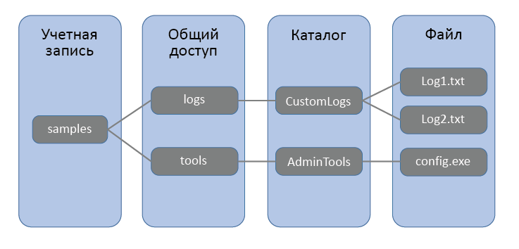

## Что такое хранилище файлов Azure?
Хранилище файлов предлагает совместно используемое хранилище для приложений, использующих стандартный протокол SMB 2.1 или SMB 3.0. Виртуальные машины и облачные службы Microsoft Azure могут использовать файловые данные компонентов приложений через подключенные ресурсы, а локальные приложения получают доступ к этим данным совместно с помощью API хранилища файлов.

Приложения, работающие на виртуальных машинах Azure или облачных службах, могут подключать ресурсы хранилищ файлов для доступа к данным файлов, так же как это бы делало настольное приложение при подключении обычного ресурса SMB. Любое количество виртуальных машин Azure может одновременно подключаться и получать доступ к ресурсам хранилища файлов.

Так как общая папка хранилища файлов представляют собой стандартную общую папку Azure, использующую протокол SMB, приложения, работающие в Azure, могут получать к ней доступ через файловые API ввода-вывода. Таким образом, разработчики могут использовать имеющиеся у них коды и навыки для миграции существующих приложений. IT-специалисты получают возможность использовать командлеты PowerShell для создания и подключения ресурсов хранилища файлов, а также управления им в качестве части администрирования приложений Azure. В данном руководстве будут приведены примеры и для первого и для второго.

Наиболее частые способы использования хранилища файлов:

* миграция локальных приложений, которые используют совместно используемые файлы, на виртуальные машины или облачные службы Azure без необходимости затратного переписывания кода;
* хранение совместно используемых настроек приложений, например файлов конфигурации;
* хранение диагностических данных, таких как журналы, метрики и аварийные дампы в совместно используемом расположении; 
* хранение средств и утилит, необходимых для разработки и администрирования виртуальных машин или облачных служб Azure.

## Основные понятия хранилища файлов
Хранилище файлов состоит из следующих компонентов:

* **Учетная запись хранения**. Весь доступ к хранилищу Azure осуществляется с помощью учетной записи хранения. Сведения об емкости учетной записи хранения см. в статье [Целевые показатели масштабируемости и производительности службы хранилища Azure](../articles/storage/storage-scalability-targets.md).
* **Общая папка** — общая папка хранилища файлов представляет собой общую папку с файлами в Azure, использующую протокол SMB. 
  Все каталоги и файлы должны быть созданы в родительской общей папке. Учетная запись может содержать любое количество общих папок, а общая папка может содержать любое количество файлов, общий размер которых не превышает 5 ТБ.
* **Каталог** — необязательная иерархия каталогов. 
* **Файл** — файл в совместно используемом ресурсе. Файлы могут иметь размер до 1 ТБ.
* **Формат URL-адреса**. К файлам можно обратиться, используя следующий формат URL-адреса:   
  https://`<storage
  account>`.file.core.windows.net/`<share>`/`<directory/directories>`/`<file>`  
  
  Следующий пример URL-адреса можно использовать для обращения к одному из файлов на схеме выше:  
  `http://samples.file.core.windows.net/logs/CustomLogs/Log1.txt`

Способ именования ресурсов, каталогов и файлов описан в статье о [присвоении имен и ссылок на совместно используемые ресурсы, каталоги, файлы и метаданные](http://msdn.microsoft.com/library/azure/dn167011.aspx).
