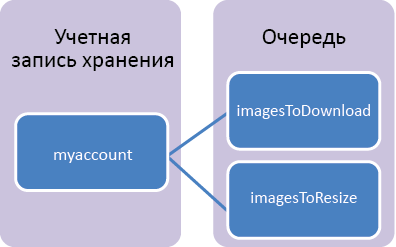

## Что такое хранилище очередей?

Хранилище очередей Azure — это служба для хранения большого количества сообщений, к которым можно получить доступ практически из любой точки мира с помощью вызовов с проверкой подлинности по протоколам HTTP или HTTPS. Одно сообщение очереди может быть размером до 64 КБ, а очередь может содержать миллионы сообщений до общего ограничения емкости учетной записи хранения. Учетная запись хранения может содержать до 500 ТБ данных BLOB-объектов, очередей и таблиц. Сведения о емкости учетной записи хранения см. на странице [Цели масштабируемости хранилища и производительности Azure](http://msdn.microsoft.com/library/azure/dn249410.aspx).

Наиболее частые способы использования хранилища очередей включают:

-   Создание списка невыполненных работ для асинхронной обработки
-   Передача сообщений из веб-роли Azure в рабочую роль Azure

## Основные понятия службы очередей

Служба очереди содержит следующие компоненты:

- **Формат URL-адреса.** К очереди можно обратиться, используя следующий формат URL-адреса: http://`<storage account>`.queue.core.windows.net/`<queue>` 
      
	Следующий URL-адрес позволяет обратиться к очереди на схеме:
		
		http://myaccount.queue.core.windows.net/imagesToDownload

- **Учетная запись хранения.** Весь доступ к хранилищу Azure осуществляется с помощью учетной записи хранения. Сведения о емкости учетной записи хранения см. на странице [Цели масштабируемости хранилища и производительности Azure](../articles/storage/storage-scalability-targets.md).

- **Очередь.** Очередь содержит набор сообщений. Все сообщения должны находиться в очереди.

- **Сообщение.** Сообщение в любом формате размером до 64 КБ.

<!---HONumber=August15_HO7-->