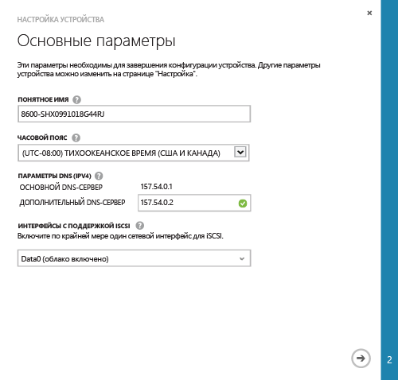
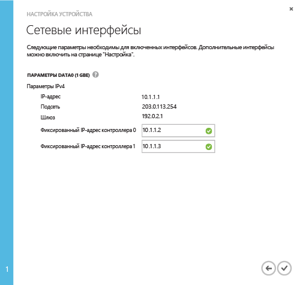

#### Минимальная настройка устройства StorSimple

1. Выберите устройство и нажмите кнопку **Быстрый запуск**. Щелкните **Настройка устройства** для запуска мастера настройки устройства.

2. В мастере настройки устройства в диалоговом окне **Основные параметры** выполните следующие действия.
  1. Укажите **понятное имя** для устройства. Имя устройства по умолчанию содержит сведения о модели устройства и серийный номер. Для управления устройством можно указать понятное имя длиной не более 64 символов.
  2. Задайте **часовой пояс** на основе географического расположения развертывания устройства. Устройство будет использовать заданный часовой пояс для всех запланированных операций.
  3. В разделе **параметры DNS** укажите адрес для **дополнительного DNS-сервера**. При использовании IPv6 поля будут заполнены на основе префикса IPv6 в интерфейсе Windows PowerShell. Если дополнительный DNS-сервер не настроен, вы не сможете сохранить конфигурацию устройства.
  4. В списке интерфейсов iSCSI включите по крайней мере одну сеть для iSCSI. Как минимум один сетевой интерфейс должен быть включен в облаке и один интерфейс должен поддерживать iSCSI. Интерфейс DATA 0 по умолчанию поддерживает облако.
 
      

3. Щелкните значок стрелки. 

4. В диалоговом окне **Сетевые интерфейсы** введите фиксированный IP-адрес для контроллеров 0 и 1. **Статические IP-адреса контроллера должны быть свободными внутри подсети, доступной по IP-адресу устройства.** Если интерфейс DATA 0 настроен для IPv4, статические IP-адреса должны быть указаны в формате IPv4. Если указан префикс для IPv6, статические IP-адреса будут заполнены автоматически в этих полях.

    Статические IP-адреса для контроллера используются для обновления устройства, поэтому они должны поддерживать маршрутизацию и подключение к Интернету.

    

5. Щелкните значок галочки . Будет выполнен возврат на страницу устройства **Быстрый запуск**.

 >[AZURE.NOTE]Другие параметры устройства можно изменить в любое время на странице **Настройка**.

<!---HONumber=62-->