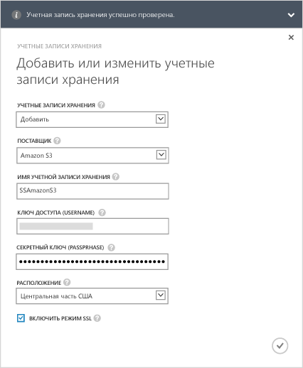
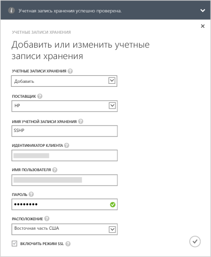
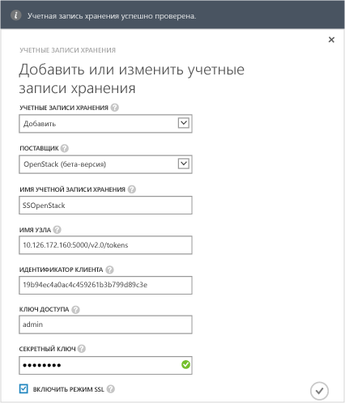

<!--author=alkohli last changed: 9/17/15-->

#### Добавление учетной записи хранения в обновлении 1.0 для серии StorSimple 8000

1. На стартовой странице службы "Диспетчер StorSimple" выберите службу и дважды щелкните ее. После этого вы перейдете на страницу **Быстрый запуск**. Выберите страницу **Настройка**.

2. Щелкните **Добавить/изменить учетную запись хранения**.

3. В диалоговом окне **Добавление или изменение учетной записи хранения** нажмите кнопку **Добавить новую**.

4. В поле **Поставщик** выберите соответствующего поставщика облачных служб. Поддерживаются следующие поставщики: Azure, Amazon S3, Amazon S3 с RRS, HP и OpenStack. Укажите учетные данные и расположение, связанное с учетной записью хранения своих поставщиков облачных служб. В зависимости от указанного поставщика облачных служб, для ввода учетных данных будут отображаться разные поля.
  - Если в качестве поставщика облачных служб вы выбрали Azure, укажите **Имя** и основной **Ключ доступа** для своей учетной записи хранения Microsoft Azure. Для учетной записи Azure расположение будет подставлено автоматически.

        

 - Если вы выбрали Amazon S3 или S3 Amazon с RRS, введите понятное **Имя учетной записи хранения**, **Ключ доступа** и **Секретный ключ**. Для Amazon S3 и Amazon S3 с RRS поддерживаются следующие расположения:

		- US Standard
		- US West (Oregon)
		- US West (Northern California)
		- EU (Ireland)
		- Asia Pacific (Singapore)
		- Asia Pacific (Sydney)
		- Asia Pacific (Tokyo)
		- South America (Sao Paulo)

        
	  		
 - Если в качестве поставщика облачных служб вы выбрали HP, введите понятное **Имя учетной записи хранения**, **Идентификатор клиента**, **Имя пользователя** и **Пароль**. Для HP поддерживаются следующие расположения:

		- US East
		- US West
	  
        
	  		
 - Если в качестве поставщика облачных служб вы выбрали **Openstack**, введите **Имя узла**, **Ключ доступа** и **Секретный ключ**.

        > [AZURE.NOTE] Для всех поставщиков облачных услуг, за исключением Azure, допускается понятное имя. Вы можете использовать понятные имена и создавать более одной учетной записи хранения с одним набором учетных данных.

        

5. Выберите **Включить режим SSL**, чтобы создать безопасный канал для обмена данными между вашим устройством и облаком. Снимайте флажок **Включить режим SSL** только в том случае, если вы работаете в частном облаке.

      >[AZURE.NOTE]Если в качестве своего поставщика вы используете HP, SSL будет всегда включен.
  		
6. Щелкните значок галочки . После успешного создания учетной записи хранения вы получите уведомление.

7. Только что созданная учетная запись хранения будет отображаться на странице **Настройка** в разделе **Учетные записи хранения**. Щелкните **Сохранить**, чтобы сохранить новую учетную запись хранения. При выводе запроса подтверждения щелкните **ОК**.

<!---HONumber=Oct15_HO3---->