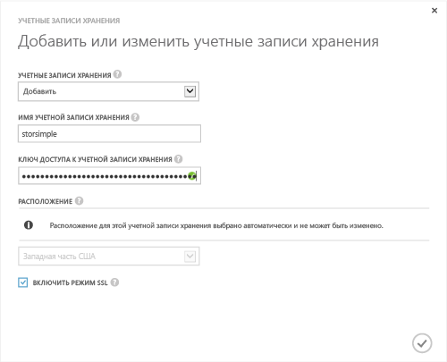

<!--author=SharS last changed: 9/17/15-->

#### Добавление новой учетной записи хранения в рабочей версии StorSimple (GA)
1. На стартовой странице службы Диспетчера StorSimple выберите службу и дважды щелкните ее. Отобразится страница **Быстрый запуск** . Выберите страницу **Настройка** .
2. Щелкните **Добавить/изменить учетную запись хранения**.
3. В диалоговом окне **Добавление или изменение учетной записи хранения** выполните следующие действия.
   
   1. Щелкните **Добавить новую**.
   2. Задайте имя вашей учетной записи хранения.
   3. Предоставьте главный **ключ доступа** для вашей учетной записи хранения Microsoft Azure.
   4. Выберите **Включить режим SSL** , чтобы создать безопасный канал для обмена данными между вашим устройством и облаком. Снимайте флажок **Включить режим SSL** только в том случае, если вы работаете в частном облаке.
   5. Щелкните значок галочки  . После успешного создания учетной записи хранения вы получите уведомление.
      
      
4. Только что созданная учетная запись хранения будет отображаться на странице **Настройка** в разделе **Учетные записи хранения**. Щелкните **Сохранить** , чтобы сохранить только что созданную учетную запись хранения. При выводе запроса подтверждения щелкните **ОК** .

