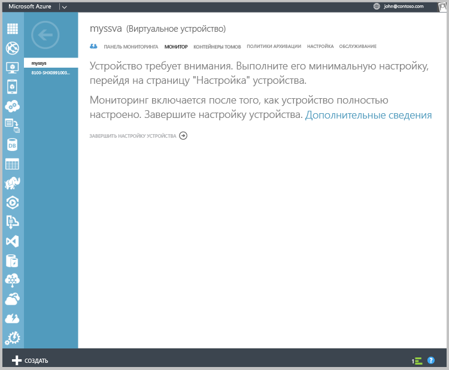
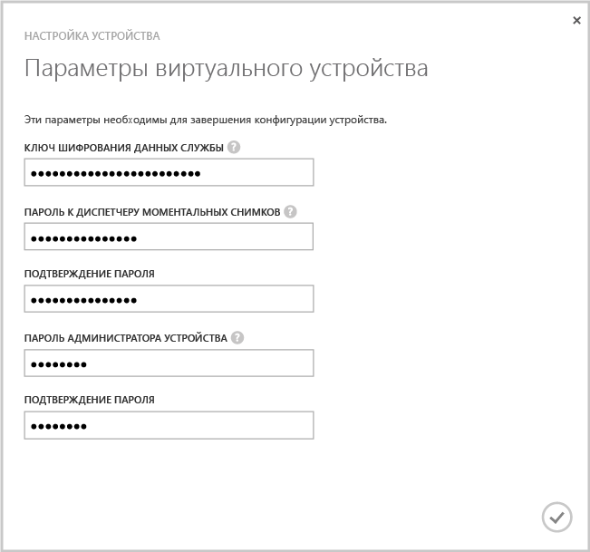
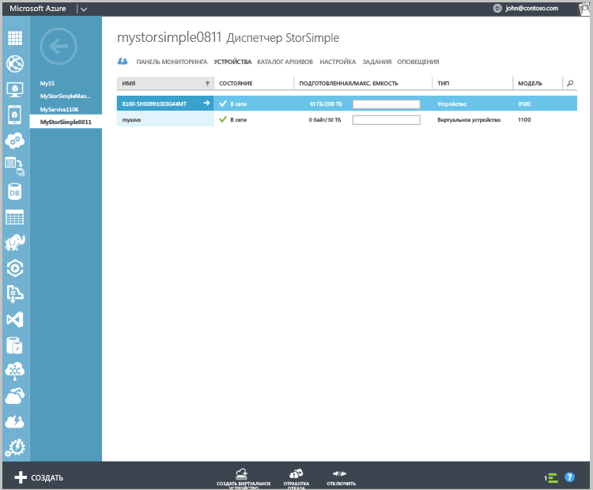

<!---author: alkohli, last updated: 11/05/2015 --->

Настройка и регистрация виртуального устройства

1. Выберите виртуальное устройство StorSimple, созданное на странице **Устройства** . 
2. Щелкните **Завершить настройку устройства**. Запустится мастер настройки устройства.
   
    
    
3. Введите **Ключ шифрования данных службы** в соответствующем поле.
4. Введите пароли диспетчера моментальных снимков и администратора устройства, соответствующие заданным параметрам и длине.
5. Установите флажок, чтобы завершить первоначальную настройку и регистрацию виртуального устройства. 
   
    

После завершения настройки и регистрации устройство будет подключено к сети. (Для подключения устройства может потребоваться несколько минут.)

<!--HONumber=Nov16_HO2-->

