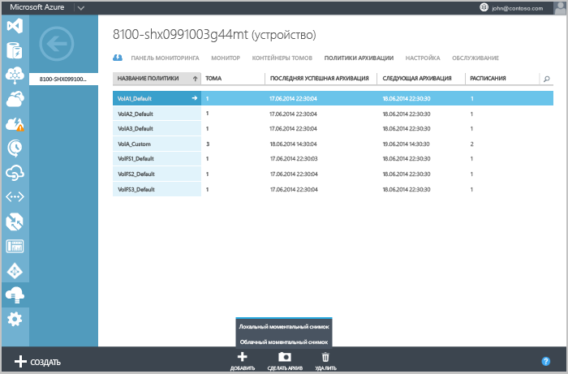
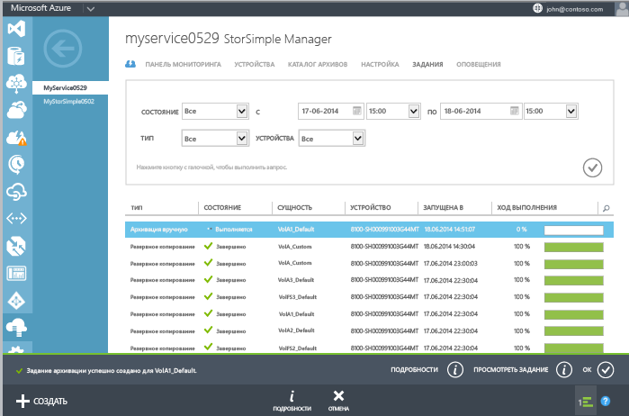

<properties 
	pageTitle="Создание резервной копии вручную" 
	description="Описание того, как вручную запускать задания резервного копирования по требованию." services="storsimple" documentationCenter="NA" 
	authors="SharS" 
	manager="adinah" 
	editor="tysonn" /> 

<tags 
   ms.service="storsimple"
   ms.devlang="NA"
   ms.topic="article"
   ms.tgt_pltfrm="NA"
   ms.workload="TBD"
   ms.date="04/01/2015"
   ms.author="v-sharos" />

### Создание резервной копии вручную

1. На странице **Устройства** перейдите на вкладку **Политики архивации**. На этой вкладке приведен список всех политик резервного копирования в табличном формате, включая политику для тома, резервную копию которого требуется создать.

2. Выберите политику, щелкнув по любому месту соответствующей строки, но не по первому столбцу. В нижней части страницы щелкните **Создать резервную копию**. Кнопка расширится так, чтобы отобразить варианты резервного копирования: локальный и облачный моментальный снимок.

3. При выборе любого из этих вариантов отобразится запрос подтверждения. Щелкните **Да**.

    
 
    После этого будет запущено задание по созданию моментального снимка. После успешного создания задания в нижней части страницы отобразится уведомление.

4. Чтобы отслеживать ход выполнения задания, щелкните **Просмотр задания** в области уведомлений (в нижней части страницы).

    

5. После выполнения задания архивации перейдите на вкладку **Каталог резервного копирования**.

6. С помощью фильтров отобразите нужное устройство, политику резервного копирования и диапазон времени. После установки фильтров нажмите значок галочки .

  Резервная копия должна появиться в списке резервных наборов данных, которые отображаются в каталоге.

<!--HONumber=52-->
