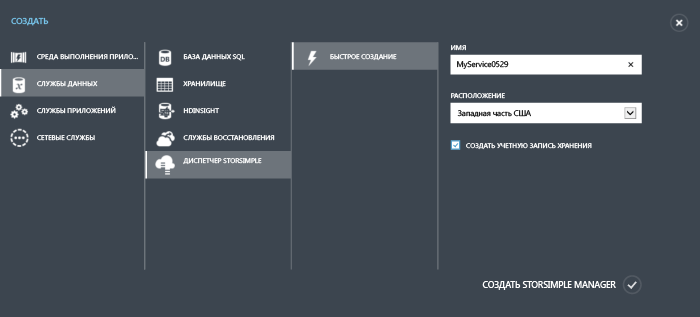

<properties 
   pageTitle="Создание новой службы Диспетчера StorSimple"
   description="Описание создания нового экземпляра службы Диспетчера StorSimple."
   services="storsimple"
   documentationCenter="NA"
   authors="SharS"
   manager="adinah"
   editor="tysonn" />
<tags 
   ms.service="storsimple"
   ms.devlang="NA"
   ms.topic="article"
   ms.tgt_pltfrm="NA"
   ms.workload="TBD"
   ms.date="04/28/2015"
   ms.author="v-sharos" />

#### Создание новой службы

1. Используя учетную запись Майкрософт, войдите на портал управления: [http://azure.microsoft.com/](http://azure.microsoft.com/).

2. На портале управления щелкните **Создать** > **Службы данных** > **Диспетчер StorSimple** > **Быстрое создание**.

3. В открывшейся форме выполните следующие действия.
  1. В поле **Имя** укажите уникальное имя для службы. Здесь необходимо указать понятное имя, пригодное для идентификации службы. Имя может содержать от 2 до 50 символов, среди которых могут быть буквы, цифры и дефисы. Имя должно начинаться и заканчиваться буквой или цифрой.
  2. Укажите **Расположение** службы. Расположение означает географический регион, в котором планируется развертывание устройства.
  3. В раскрывающемся списке **Подписка** выберите подписку. Подписка привязана к учетной записи для выставления счетов. Это поле отсутствует, если у вас имеется только одна подписка.
  4. Выберите **Создать новую учетную запись хранения**, чтобы автоматически создать учетную запись хранения одновременно со службой. Эта учетная запись хранения будет иметь специальное имя, например storsimplebwv8c6dcnf.
  5. Щелкните **Создать диспетчер StorSimple**, чтобы создать службу.

       

     Будет выполнено перенаправление на стартовую страницу **Служба**. Создание службы займет несколько минут. После успешного создания службы будет выведено уведомление и состояние службы сменится на **Активна**.
 
       

<!---HONumber=58_postMigration-->