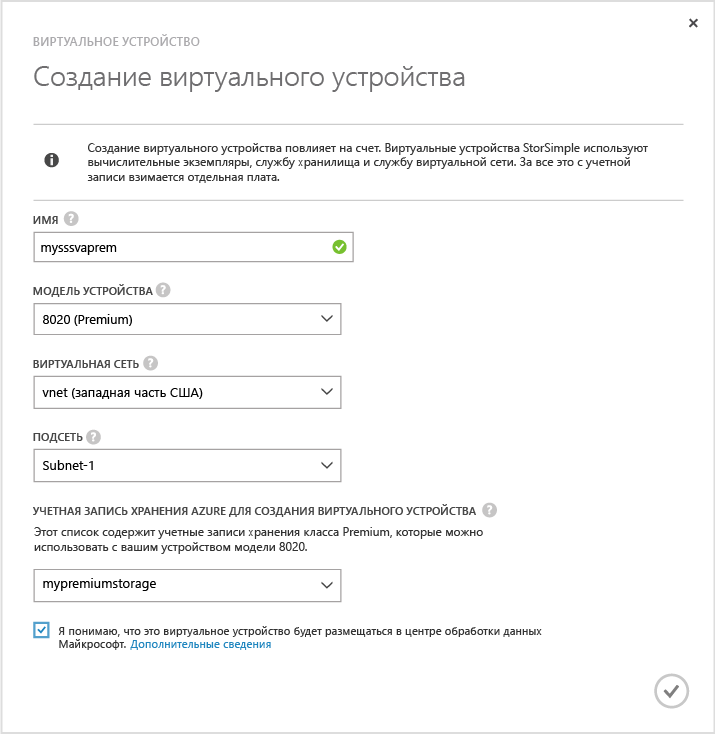
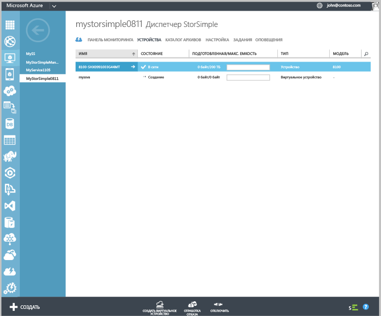

#### Создание виртуального устройства
1. В портале Azure перейдите в службу **диспетчера StorSimple**.
2. Откройте страницу **Устройства**. Щелкните **Создать виртуальное устройство** в нижней части страницы **Устройства**.
3. В диалоговом окне **Создание виртуального устройства** укажите следующее:
   
     
   
   1. **Имя** — уникальное имя виртуального устройства.
   2. **Модель** — выберите модель виртуального устройства. Это поле отображается только в том случае, если используется обновление версии 2 или более поздней версии. Модель устройства 8010 предлагает 30 ТБ хранилища класса Standard, а 8020 имеет 64 ТБ хранилища класса Premium. Укажите 8010
   3. для развертывания сценариев извлечения уровня элемента из резервных копий. Выберите 8020 для развертывания высокопроизводительных рабочих нагрузок с низкой задержкой или использования устройства в качестве вторичного устройства для аварийного восстановления.
   4. **Версия** — выберите версию виртуального устройства. Если выбрана модель устройства 8020, поле версии не будет отображаться для пользователя. Этот параметр будет отсутствовать, если на всех физических устройствах, зарегистрированных с помощью этой службы, запущено обновление версии 1 (или более поздней версии). Это поле будет отображаться, только если вы зарегистрировали в одной и той же службе физические устройства как с предварительным обновлением версии 1, так и с обновлением версии 1. При наличии версии виртуального устройства вы сможете определить, с какого физического устройства можно выполнить отработку отказа или клонирование. Важно создать соответствующую версию виртуального устройства. Выбор:
      
      * Обновление до версии 0.3 при отработке отказа или аварийном восстановлении с физического устройства с обновлением версии 0.3 или более ранней версии. 
      * Обновление до версии 1 при отработке отказа или клонировании с физического устройства с обновлением версии 1 (или более поздней версии). 
   5. **Виртуальная сеть** — укажите виртуальную сеть, которую следует использовать для этого виртуального устройства. При использовании хранилища класса Premium (обновление версии 2 или более поздней версии) необходимо выбрать виртуальную сеть, которая поддерживается учетной записью хранения класса Premium. Неподдерживаемые виртуальные сети в раскрывающемся списке будут выделены серым. При выборе неподдерживаемой виртуальной сети вы увидите предупреждение. 
   6. **Учетная запись хранения для создания виртуального устройства** — выберите учетную запись хранения для хранения образа виртуального устройства во время подготовки. Эта учетная запись хранения должна находиться в том же регионе, что и виртуальное устройство и виртуальная сеть. Она не должна использоваться для хранения данных физическим или виртуальным устройством. По умолчанию для этой цели будет создана новая учетная запись хранения. Однако если у вас уже есть подходящая учетная запись хранения, вы можете выбрать ее в списке. При создании виртуального устройства класса Premium в раскрывающемся списке будут отображаться только учетные записи хранения класса Premium.
      
      > [!NOTE]
      > Виртуальное устройство работает только с учетными записями хранения Azure. Другие поставщики облачных служб, например Amazon, HP и OpenStack (которые поддерживаются для физического устройства), не поддерживаются для виртуального устройства StorSimple.
      > 
      > 
   7. Установите флажок, чтобы указать, что вы понимаете, что данные, сохраненные на виртуальном устройстве, будут размещены в центре обработки данных Майкрософт. При использовании только физического устройства ваш ключ шифрования сохраняется на устройстве, следовательно, Майкрософт не может расшифровать его.
      
       При использовании виртуального устройства ключ шифрования и ключ расшифровки хранятся в Microsoft Azure. Дополнительные сведения см. в статье [Рекомендации по безопасности при использовании виртуального устройства](../articles/storsimple/storsimple-security.md#storsimple-virtual-device-security).
   8. Чтобы создать виртуальное устройство, поставьте галочку. Подготовка устройства может занять около 30 минут.
      
      

<!---HONumber=AcomDC_1217_2015-->