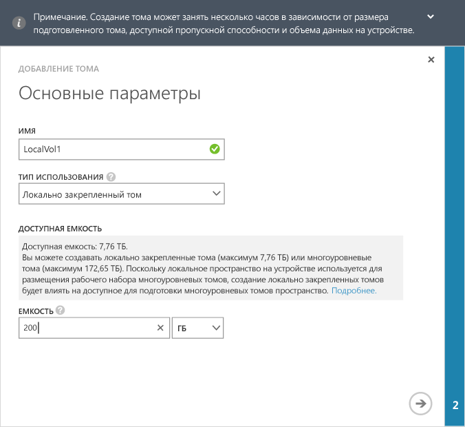

<!--author=alkohli last changed: 08/16/2016-->

#### Создание тома
1. На странице **Быстрый запуск** на устройстве щелкните **Добавить том**, чтобы запустить соответствующий мастер.
2. В разделе **Основные параметры**окна мастера добавления тома выполните следующие действия.
   
   1. В поле **Имя** введите имя тома.
   2. В раскрывающемся списке **Тип использования** выберите нужный тип для тома. Для рабочих нагрузок, которые требуют локальных гарантий, низкой задержки и более высокой производительности, выберите **Локально закрепленный том** . Для любых других типов данных выберите **Многоуровневый том** . Если вы используете этот том для архивных данных, установите флажок **Использовать этот том для архивных данных, доступ к которым осуществляется нечасто**. 
      
       Локально закрепленные тома подготавливаются "тесно", это гарантирует, что основные данные тома остаются локальными для устройства и не будут вытеснены в облако.  При создании локально закрепленного тома устройство проверяет доступное пространство на локальных уровнях для подготовки тома запрошенного размера. Операция создания локально закрепленного тома может включать в себя вытеснение существующих данных с устройства в облако, поэтому для создания тома может потребоваться длительное время. Общее время создания тома зависит от размера подготавливаемого тома, доступной пропускной способности сети и данных устройства. 
      
       Для многоуровневых томов предусмотрена тонкая подготовка и возможность быстрого создания. При установке флажка **Используйте этот том для архивных данных, доступ к которым осуществляется нечасто** для многоуровневых томов с архивными данными размер блока дедупликации тома изменяется на 512 КБ. Если этот флажок не установлен, соответствующий многоуровневный том использует размер блока 64 КБ. Больший размер блока дедупликации позволяет устройству быстро передавать большие блоки архивных данных в облако.
   3. В поле **Выделяемый объем** задайте емкость тома. Запишите емкость, которая доступна на основе выбранного типа тома. Указанный размер тома не должен превышать доступное пространство.
      
       На устройстве 8100 можно подготавливать локально закрепленные тома размером до 8,5 ТБ и многоуровневые тома размером до 200 ТБ. На устройстве 8600, которое отличается большим размером, можно подготавливать локально закрепленные тома размером до 22,5 ТБ и многоуровневые тома размером до 500 ТБ. Так как в локальном пространстве на устройстве размещается рабочий набор многоуровневых томов, то создание локально закрепленных томов влияет на пространство, доступное для подготовки многоуровневых томов. Поэтому при создании локально закрепленного тома свободное пространство для создания многоуровневых томов уменьшится. Точно так же при создании многоуровневого тома доступное пространство для создания локально закрепленных томов уменьшается.
      
       При подготовке локально закрепленного тома размером 8,5 ТБ (максимально допустимый размер) на устройстве 8100 все локальное свободное пространство будет исчерпано. С этого момента вы больше не сможете создавать многоуровневые тома, так как на устройстве нет локального пространства для размещения рабочего набора многоуровневых томов. Существующие многоуровневые тома также влияют на доступное место. Например, если у вас есть устройство 8100, на котором уже есть многоуровневые тома размером около 106 ТБ, для локально закрепленных томов доступно только 4 ТБ пространства.
      
       На следующем рисунке показано диалоговое окно **Основные параметры** для локально закрепленного тома.
      
        
      
       На следующем рисунке показано диалоговое окно **Основные параметры** для многоуровневого тома.
      
        
   
   1. Нажмите кнопку с изображением стрелки   , чтобы перейти к следующей странице.
3. В диалоговом окне **Дополнительные параметры** добавьте новую запись управления доступом (ACR).
   
   1. В поле **Имя** введите имя записи управления доступом.
   2. В разделе **Имя инициатора iSCSI**укажите полное имя iSCSI (IQN) используемого узла Windows. Если IQN отсутствует, перейдите к разделу [Получение IQN узла Windows Server](#get-the-iqn-of-a-windows-server-host).
   3. В разделе **Включить архивацию по умолчанию для этого тома** установите флажок **Включить**. Резервное копирование по умолчанию создает политику, при которой в 22:30 по времени устройства каждый день будет создаваться облачный моментальный снимок этого тома.
      
      > [!NOTE]
      > После того как в этом разделе будет создано правило архивации, удалить его будет невозможно. Чтобы изменить этот параметр, вам нужно изменить том.
      > 
      > 
      
      
4. Щелкните значок галочки  . Создан том с указанными настройками.

