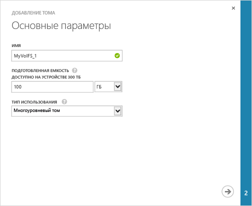
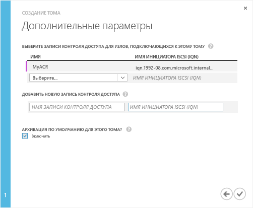

<!--author=SharS last changed: 9/17/15-->

#### Создание тома

1. На странице устройства **Быстрый запуск** щелкните **Добавить том**. Запустится мастер добавления тома.

2. В разделе **Основные параметры** окна мастера добавления тома выполните следующие действия.
   1. В поле **Имя** введите имя тома.
   2. В поле **Выделяемый объем** задайте емкость тома. **Емкость тома должна быть в диапазоне от 1 ГБ до 64 ТБ.**
   3. В раскрывающемся списке **Тип использования** выберите нужный тип для тома. Для архивных данных, доступ к которым осуществляется не так часто, выберите **Архивный том**. Для любых других типов данных выберите **Многоуровневый том**. (Многоуровневые тома раньше назывались основными.)
   4. Нажмите кнопку с изображением стрелки , чтобы перейти к следующей странице.

     

3. В диалоговом окне **Дополнительные параметры** добавьте новую запись управления доступом (ACR).
   1. В поле **Имя** введите имя записи управления доступом.
   2. В разделе **Имя инициатора iSCSI** укажите полное имя iSCSI (IQN) используемого узла Windows. Если IQN отсутствует, перейдите к разделу [Получение IQN узла Windows Server](#get-the-iqn-of-a-windows-server-host).
   3. В разделе **Задать архивацию по умолчанию для этого тома?** установите флажок **Включить**. Резервное копирование по умолчанию создаст политику, при которой в 22:30 по времени устройства каждый день будет создаваться облачный моментальный снимок этого тома.

     >[AZURE.NOTE]После того как в этом разделе будет создано правило архивации, удалить его будет невозможно. Чтобы изменить этот параметр, вам потребуется изменить том.

     

4. Щелкните значок галочки . Будет создан том с указанными настройками.

 **Доступный видеоролик**

Чтобы просмотреть видеоролик о том, как создать том StorSimple, щелкните [здесь](http://azure.microsoft.com/documentation/videos/create-a-storsimple-volume/).

<!---HONumber=Oct15_HO3-->