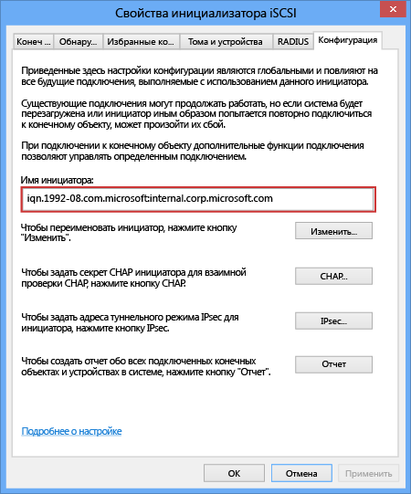

#### Получение IQN узла Windows

1. Запустите инициатор iSCSI (Майкрософт) на узле Windows.

2. В окне **Свойства инициатора iSCSI** на вкладке **Конфигурация** выберите и скопируйте строку из поля **Имя инициатора**.
 
    

3. Сохраните эту строку.

<!---HONumber=July15_HO2-->