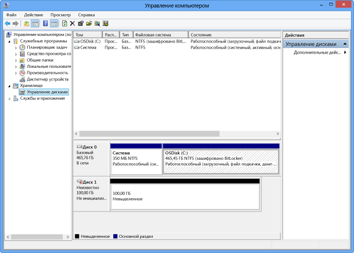

<!--author=SharS last changed: 9/17/15-->

#### Подключение, инициализация и форматирование тома
1. Запустите инициатор iSCSI (Майкрософт).
2. В окне **свойств инициатора iSCSI** на вкладке **Обнаружение** щелкните **Обнаружить портал**.
3. В диалоговом окне **Обнаружение целевого портала** укажите IP-адрес сетевого интерфейса с поддержкой iSCSI и нажмите кнопку **ОК**. 
4. В окне **свойств инициатора iSCSI** на вкладке **Конечные объекты** найдите элемент **Обнаруженные конечные объекты**. Устройство должно быть в состоянии **Неактивно**.
5. Выберите целевое устройство и нажмите кнопку **Подключиться**. После подключения устройства состояние должно измениться на **Подключено**. (Дополнительные сведения об использовании инициатора Microsoft iSCSI см. в разделе [Установка и настройка инициатора Microsoft iSCSI][1].)
6. На узле Windows нажмите клавиши Windows + X, а затем щелкните **Выполнить**. 
7. В диалоговом окне **Выполнить** введите **Diskmgmt.msc**. Нажмите кнопку **ОК**. На экране отобразится диалоговое окно **Управление дисками**. На панели справа будут показаны тома на вашем узле.
8. В окне **Управление дисками** подключенные тома отображаются так, как показано на следующем рисунке. Щелкните правой кнопкой мыши обнаруженные тома (щелкните имя диска) и выберите пункт **Подключить**.
   
      
9. Щелкните правой кнопкой мыши том (щелкните имя диска), а затем нажмите кнопку **Инициализировать**.
10. Чтобы отформатировать простой том, выполните такие действия.
    
    1. Выберите том, щелкните его правой кнопкой мыши (щелкните область справа), а затем нажмите кнопку **Создать простой том**.
    2. В мастере создания простого тома укажите размер и букву диска для тома и настройте том с файловой системой NTFS.
    3. Выберите размер кластера 64 КБ. Этот размер кластера прекрасно подходит для алгоритмов дедупликации, используемых в решении StorSimple.
    4. Выполните быстрое форматирование.

 **Доступный видеоролик**

Чтобы просмотреть видеоролик о том, как монтировать, инициализировать и форматировать том StorSimple, щелкните [здесь](https://azure.microsoft.com/documentation/videos/mount-initialize-and-format-a-storsimple-volume/).

<!--Link references-->
[1]: https://technet.microsoft.com/library/ee338480(WS.10).aspx

<!--HONumber=Nov16_HO2-->

