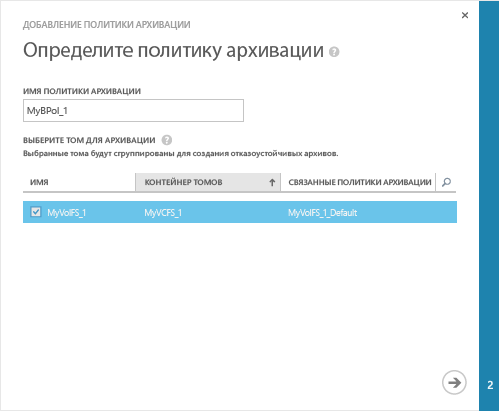
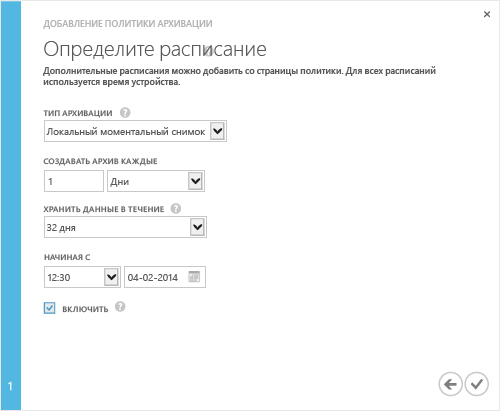

### Создание резервной копии

1. На странице устройства **Быстрый запуск**, щелкните **Добавить политику резервного копирования**. Запустится мастер добавления политики резервного копирования. 

2. На странице **Определение политики резервного копирования**:
  1. Введите имя политики резервного копирования длиной от 3 до 150 знаков.
  2. Выберите тома для резервного копирования. При выборе нескольких томов эти тома группируются вместе для создания отказоустойчивой резервной копии.
  3. Щелкните значок с изображением стрелки . 
  
    

3. На странице **Определить расписание**:
  1. В раскрывающемся списке выберите тип резервного копирования. Чтобы восстановление выполнялось быстрее, выберите вариант **Локальный моментальный снимок**. Чтобы обеспечить устойчивость данных, выберите **Облачный моментальный снимок**.
  2. Укажите интервал резервного копирования в минутах, часах, днях или неделях.
  3. Выберите период удержания. Возможные периоды удержания зависят от частоты резервного копирования. Например, для политики ежедневного резервного копирования период удержания можно указать в неделях, а для политики ежемесячного резервного копирования — в месяцах.
  4. Выберите время и дату начала применения политики резервного копирования.
  5. Установите флажок **Включить**, чтобы включить политику резервного копирования. 
  6. Щелкните значок с изображением флажка , чтобы сохранить политику.

    
 
     Теперь у вас есть политика резервного копирования, на основе которой будет выполняться резервное копирование данных тома по расписанию.

Настройка устройства завершена.

<!---HONumber=July15_HO2-->