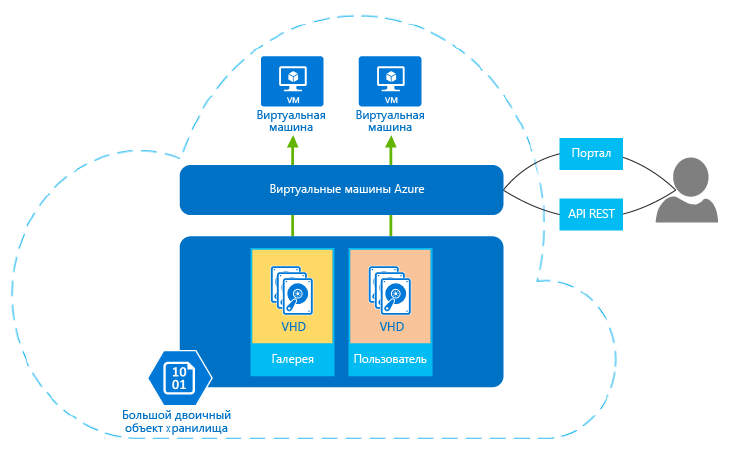

## Информация о виртуальных машинах в Azure

Виртуальные машины Azure позволяют создавать и использовать виртуальные машины в облаке. Используемый в технологии для виртуальных машин подход *IaaS (инфраструктура как служба)*, позволяет применять ее различными способами. Ниже приведены некоторые примеры.

- **Виртуальные машины для разработки и тестирования.** Группы разработчиков часто используют виртуальные машины, так как они обеспечивают быстрый и простой способ создания компьютера с определенными конфигурациями, необходимыми для написания кода и тестирования приложения. Виртуальные машины Azure предлагают рациональный и экономичный способ создания виртуальных машин с последующим удалением тех из них, которые больше не требуются.
- **Выполнение приложений в облаке.** Некоторые приложения выгодно выполнять в общедоступном облаке по экономическим соображениям. Одним из примеров является приложение со значительными пиками нагрузки из-за большого числа запросов. Всегда можно оборудовать свой центр обработки данных с количеством оборудования, достаточным для обработки этих пиков, но большинство из этого оборудования, скорее всего, будет простаивать. Выполнение этого приложения в Azure позволяет вам оплачивать дополнительные виртуальные машины только в случае необходимости и завершать их работу после использования. Или предположим, что вы недавно открыли компанию, которой требуется быстро получить вычислительные ресурсы по запросу без каких-либо обязательств. И в этом случае правильным выбором станет Azure.
- **Расширение своего центра обработки данных в общедоступное облако.** С помощью виртуальной сети Azure ваша организация может создать виртуальную сеть (VNET), представляющую собой часть вашей локальной сети, и добавлять виртуальные машины в нее. Это позволяет выполнять на виртуальной машине Azure такие приложения, как [SharePoint](../articles/virtual-machines/virtual-machines-windows-sharepoint-farm-structure.md), [SQL Server](../articles/virtual-machines/virtual-machines-windows-sql-server-iaas-overview.md) и т. д. Этот подход более легкий в реализации и экономически выгодней, чем выполнение приложений на виртуальных машинах в вашем центре обработки данных.   
- **Аварийное восстановление.** При использовании аварийного восстановления, основанного на IaaS, вместо непрерывной оплаты редко используемого резервного центра обработки данных вы можете оплачивать нужные вычислительные ресурсы только в случае действительной необходимости. Например, если на вашем основном центре обработки данных возникает сбой, вы можете создать в Azure виртуальные машины для выполнения наиболее важных приложений, а затем, когда необходимость в них отпадет, завершить их работу.

Как и у других виртуальных машин, у виртуальной машины в Azure есть операционная система, возможности для хранения и работы в сети, а также поддержка выполнения самых разнообразных приложений. Вы можете использовать образ, предоставленный компанией Azure или одним из ее партнеров, или использовать свой образ. Примеры различных версий, сборок и конфигураций:
 
- Серверы Linux Suse, Ubuntu и CentOS
- Windows Server 
- SQL Server
- BizTalk Server 
- SharePoint Server

Для хранения операционной системы и данных виртуальные машины используют виртуальные жесткие диски (VHD). Они также используются для образов, которые доступны для установки операционной системы. На следующем рисунке показаны виртуальные жесткие диски, а также два инструмента для создания виртуальных машин и управления ими.

 

**Рисунок. Виртуальные машины Azure предоставляют инфраструктуру как услугу**

Управление виртуальными машинами осуществляется с помощью браузерного портала, программ командной строки с поддержкой создания сценариев или напрямую с помощью REST API. Партнеры корпорации Майкрософт, такие как RightScale и ScaleXtreme, также предлагают службы управления, основанные на API REST.

Кроме ОС, в виртуальных машинах можно настроить следующие параметры.

- Размер, который определяет такие факторы, как количество присоединяемых дисков и вычислительную мощность. Azure предлагает широкий спектр размеров для поддержки разных вариантов использования. Дополнительную информацию см. в статье [Размеры виртуальных машин](../articles/virtual-machines/virtual-machines-linux-sizes.md).  
- Регион Azure, в котором будет размещаться новая виртуальная машина, например США, Европа или Азия. 
- Расширения виртуальных машин, которые предоставляют дополнительные возможности вашей виртуальной машине, например запуск антивирусной программы или использование функции настройки требуемого состояния Windows PowerShell.

Другие преимущества для виртуальных машин.

**Оплата по мере использования**. Azure взимает почасовую оплату на основе размера и операционной системы виртуальной машины. При частичном использовании Azure взимает плату только за минуты использования. Плата за использование хранилища взимается отдельно. Дополнительную информацию см. в разделе [Цены на виртуальные машины](https://azure.microsoft.com/pricing/details/virtual-machines/).

**Устойчивость**. Azure выполняет мониторинг физического оборудования, на котором размещена каждая выполняемая виртуальная машина. В случае сбоя физического сервера, на котором выполняется виртуальная машина, Azure обнаруживает его, перемещает виртуальной машину на новое оборудование и перезапускает ее. Этот процесс иногда называется восстановлением службы. Кроме того, Azure защищает данные виртуальной машины, сохраняя резервные копии виртуальных жестких дисков в хранилище больших двоичных объектов.

<!---HONumber=AcomDC_0413_2016-->