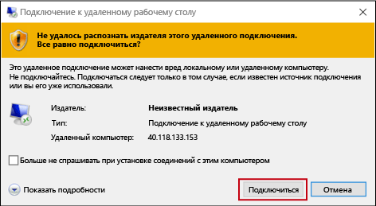
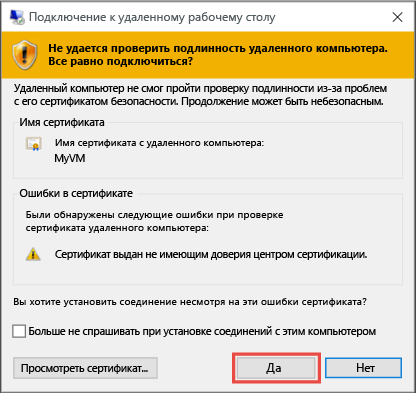

1. Щелкните кнопку **Подключить** , чтобы создать и скачать файл протокола удаленного рабочего стола (RDP-файл). Чтобы воспользоваться этим файлом, щелкните **Открыть** .
2. Появится предупреждение, что издатель файла `.rdp` неизвестен. Это нормально. Чтобы продолжить, в окне удаленного рабочего стола нажмите кнопку **Подключить** .
   
    
3. В окне **Безопасность Windows** выберите **Варианты выбора** и нажмите **Использовать другую учетную запись**. Введите учетные данные учетной записи виртуальной машины и нажмите кнопку **ОК**.
   
     **Локальная учетная запись** — как правило, это имя пользователя и пароль, указанные при создании виртуальной машины. В данном случае домен представляет собой имя виртуальной машины и вводится в формате *имя_виртуальной_машины*&#92;*имя_пользователя*.  
   
    **Присоединенная к домену виртуальная машина** — если виртуальная машина входит в домен, введите имя пользователя в формате *домен*&#92;*имя_пользователя*. Учетная запись также должна входить в группу "Администраторы" или ей должны быть назначены права удаленного доступа к виртуальной машине.
   
    **Контроллер домена** — если виртуальная машина является контроллером домена, введите имя пользователя и пароль для учетной записи администратора домена для этого домена.
4. Щелкните **Да** для проверки удостоверения виртуальной машины и завершения входа в систему.
   
   

