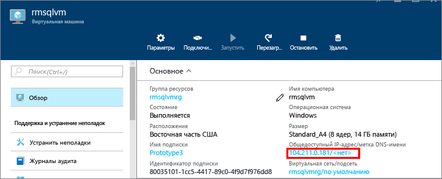
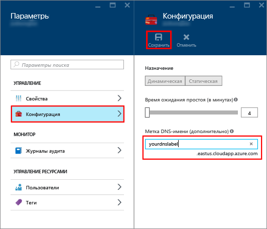
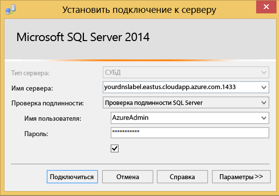

### Настройка имени DNS для общедоступного IP-адреса

Для подключения к СУБД SQL Server через Интернет необходимо сначала настроить имя DNS для вашего общедоступного IP-адреса. Обратите внимание, что этот шаг является обязательным, за исключением тех случаев, когда вы подключаетесь к экземпляру SQL Server в той же виртуальной сети или на локальном компьютере.

Чтобы создать имя DNS, выберите **Виртуальные машины** на портале. Выберите виртуальную машину SQL Server, чтобы открыть ее свойства.

1. В колонке виртуальной машины выберите ваш **Общедоступный IP-адрес**.

	

2. В свойствах общедоступного IP-адреса разверните раздел **Конфигурация**.

3. Введите имя DNS. Это запись, которую можно использовать для подключения к виртуальной машине SQL Server по имени, а не по IP-адресу.

	

### Подключение к ядру СУБД с другого компьютера
 
1. На компьютере, подключенном к сети Интернет, откройте SQL Server Management Studio (SSMS).

2. В диалоговом окне **Подключение к серверу** или **Подключение к СУБД** в поле **Имя сервера** введите полное DNS-имя виртуальной машины (определенное в предыдущей задаче).

3. В поле **Проверка подлинности** выберите **Проверка подлинности SQL Server**.

5. В поле **Имя пользователя** введите имя пользователя SQL.

6. В поле **Пароль** введите пароль для этого пользователя.

7. Щелкните **Подключить**.

	

<!---HONumber=AcomDC_0107_2016-->