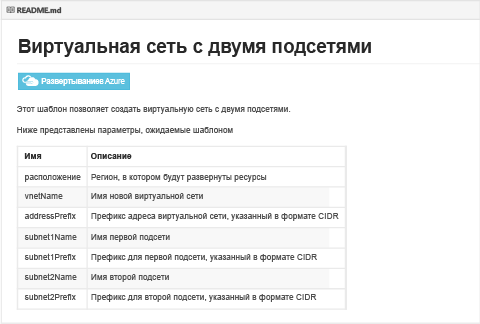
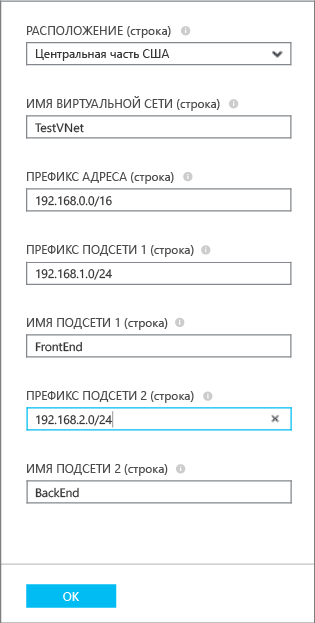
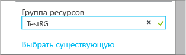
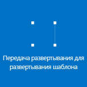

## Развертывание шаблона ARM с помощью кнопки развертывания

Вы можете использовать шаблоны ARM, уже настроенные и загруженные в репозиторий Github корпорации Майкрософт и доступные для всех. Эти шаблоны можно развернуть прямо из репозитория или загрузить и внести необходимые изменения. Чтобы развернуть шаблон, создающий виртуальную сеть с двумя подсетями, выполните описанные ниже действия.

1. В браузере откройте страницу [https://github.com/Azure/azure-quickstart-templates](https://github.com/Azure/azure-quickstart-templates).
2. Прокрутите список шаблонов вниз и выберите шаблон **101-two-subnets**. Просмотрите файл **README.md**, который будет выглядеть следующим образом.

	

3. Нажмите кнопку **Развернуть в Azure**. При необходимости введите учетные данные для входа в Azure.
4. В колонке **Параметры** введите значения, которые нужно использовать для создания новой виртуальной сети, и нажмите кнопку **ОК**. Значения для нашего сценария представлены ниже.

	

4. Выберите параметр **Группы ресурсов** и укажите группу ресурсов, которую нужно добавить в виртуальную сеть, или щелкните **Создать**, чтобы добавить виртуальную сеть в новую группу ресурсов. Дополнительные сведения о группах ресурсов см. в статье . На приведенном ниже рисунке показаны параметры новой группы ресурсов с именем **TestRG**.

	

5. При необходимости измените параметры **Подписка** и **Расположение** для виртуальной сети.
6. Если вы не хотите, чтобы виртуальная сеть отображалась в виде элемента на **начальной панели**, снимите флажок **Закрепить на начальной панели**.
5. Щелкните **Условия Leagl**, ознакомьтесь с условиями и примите их, нажав кнопку **Купить**. 
6. Щелкните **Создать**, чтобы создать виртуальную сеть.

	

7. После завершения развертывания последовательно выберите параметры **TestVNet** > **Все параметры** > **Подсети**, чтобы просмотреть свойства подсети, как показано ниже.

	

<!---HONumber=August15_HO9-->