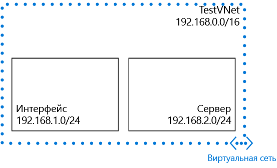

## Сценарий

Чтобы проиллюстрировать процесс создания виртуальной сети и подсетей, в этом документе будет использоваться представленный ниже сценарий.

В этом сценарии вы создадите виртуальную сеть с именем **TestVNet** и зарезервированным блоком CIDR **192.168.0.0./16**. Виртуальная сеть содержит следующие подсети: 

* **FrontEnd** с блоком **192.168.1.0/24** в качестве блока CIDR.
* **BackEnd** с блоком **192.168.2.0/24** в качестве блока CIDR.

