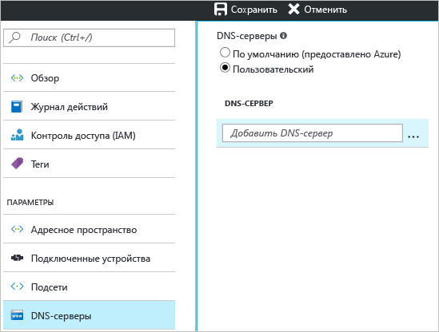

Этот параметр позволяет указать DNS-сервер, который вы хотите использовать для разрешения имен в этой виртуальной сети. Он не приводит к созданию DNS-сервера.

1. На странице **параметров** виртуальной сети щелкните **DNS-серверы**, чтобы открыть соответствующую колонку.
2. На странице **DNS-серверы** в разделе **DNS-серверы** выберите **Пользовательский**.
3. В поле **DNS-сервер** в текстовом поле **Добавить DNS-сервер** введите IP-адрес DNS-сервера, который вы хотите использовать для разрешения имен.
4. После того как вы добавили DNS-серверы, нажмите кнопку **Сохранить** в верхней части колонки, чтобы сохранить конфигурацию.
   
    

<!--HONumber=Nov16_HO2-->

