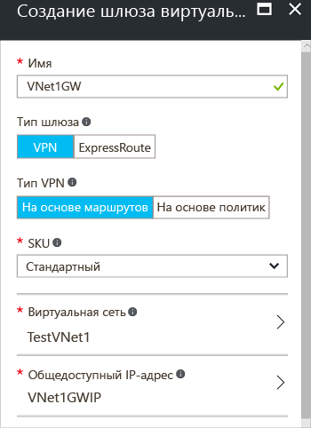

1. На странице портала слева щелкните **+** и выполните поиск по запросу "Шлюз виртуальной сети". В **результатах** найдите и щелкните **Шлюз виртуальной сети**. Щелкните **Создать** в нижней части колонки **Шлюз виртуальной сети**. Откроется колонка **Create virtual network gateway** (Создание шлюза виртуальной сети).
2. В колонке **Создание шлюза виртуальной сети** укажите необходимые значения параметров.

    
3. **Имя**. Назовите свой шлюз. Это имя должно отличаться от имени подсети шлюза. Это имя объекта шлюза, который создается.
4. **Тип шлюза**. Выберите **VPN**. VPN-шлюзы используют тип шлюза виртуальной сети **VPN**. 
5. **Тип VPN**. Выберите тип VPN, который указан для конфигурации. Для большинства конфигураций требуется тип VPN на основе маршрута.
6. **SKU**. Выберите номер SKU шлюза из раскрывающегося списка. Номера SKU, перечисленные в раскрывающемся списке, зависят от выбранного типа VPN.
7. **Расположение**. Вам может понадобится прокрутить содержимое, чтобы увидеть расположение. В поле **Расположение** укажите расположение виртуальной сети. Если расположение не указывает на регион, в котором размещена виртуальная сеть, такая виртуальная сеть не будет отображаться в раскрывающемся списке выбора виртуальной сети (см. следующий шаг).
8. **Виртуальная сеть**. Выберите виртуальную сеть, в которую будет добавлен этот шлюз. Щелкните **Виртуальная сеть**, чтобы открыть колонку **Выберите виртуальную сеть**. Выберите виртуальную сеть. Если ваша виртуальная сеть не отображается, проверьте, указан ли в поле **Расположение** регион, в котором находится эта сеть.
9. **Общедоступный IP-адрес**. Будет создан объект общедоступного IP-адреса, которому динамически назначается общедоступный IP-адрес. Щелкните **Общедоступный IP-адрес**, чтобы открыть колонку **Выбрать общедоступный IP-адрес**. Щелкните **+Создать**, чтобы открыть колонку **Создать общедоступный IP-адрес**. Введите имя общедоступного IP-адреса. Нажмите кнопку **ОК**, чтобы сохранить изменения в этой колонке.

    
10. **Подписка**. Проследите, чтобы отображалась правильная подписка.
11. **Группа ресурсов**. Параметр зависит от выбранной виртуальной сети. 
12. Не изменяйте сведения в поле **Расположение** после указания предыдущих параметров.
13. Проверьте параметры. В нижней части колонки можно выбрать параметр **Закрепить на панели мониторинга** , если необходимо, чтобы шлюз отображался на панели мониторинга.
14. Щелкните **Создать** , чтобы создать шлюз. Параметры будут проверены, и на панели мониторинга появится плитка Deploying Virtual network gateway (Развертывание шлюза виртуальной сети). Создание шлюза может занять до 45 минут. Вам понадобится обновить страницу портала, чтобы увидеть готовое состояние.
    
    
15. Создав шлюз, вы можете просмотреть назначенный ему IP-адрес в разделе сведений о виртуальной сети на портале. Шлюз будет отображаться как подключенное устройство. Щелкните подключенное устройство (шлюз виртуальной сети), чтобы получить дополнительные сведения.