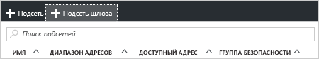

1. На [портале](http://portal.azure.com) перейдите к виртуальной сети Resource Manager, для которой необходимо создать шлюз.
2. На странице виртуальной сети в разделе **Параметры** щелкните **Подсети**, чтобы открыть страницу "Подсети".
3. На странице **Подсети** щелкните **+Подсеть шлюза**. Откроется страница **Добавление подсети**.

  
4. В поле **Имя** автоматически добавляется значение GatewaySubnet. По этому имени Azure идентифицирует подсеть как подсеть шлюза. Настройте автоматическое заполнение значений **диапазона адресов** для соответствия требованиям конфигурации, а затем щелкните **ОК** в нижней части страницы, чтобы создать подсеть.

  