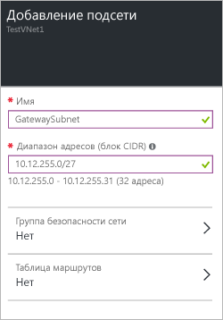

1. На портале перейдите к виртуальной сети, которую необходимо подключить к шлюзу.

2. В колонке виртуальной сети в разделе **Параметры** щелкните **Подсети**, чтобы открыть соответствующую колонку.

3. В колонке **Подсети** щелкните **+ Подсеть шлюза**. Откроется колонка **Добавление подсети**. В поле **Имя** автоматически добавляется значение GatewaySubnet. По этому имени Azure идентифицирует подсеть как подсеть шлюза.

	

4. При необходимости диапазон адресов (блок CIDR) можно изменить. Чтобы правильно выбрать блок CIDR, проверьте требования к своей конфигурации.

5. В нижней части колонки нажмите кнопку **ОК**, чтобы создать подсеть.

<!---HONumber=AcomDC_0810_2016---->