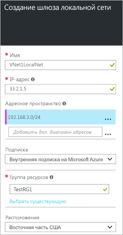

1. На портале щелкните **Создать** > **Сети** > **Шлюз локальной сети**.

	.

2. В колонке **создания шлюза локальной сети** укажите **имя** для своего шлюза.
 
3. Укажите допустимый общедоступный **IP-адрес** для VPN-устройства или шлюза виртуальной сети, к которому необходимо подключиться. Если локальная сеть представляет локальное расположение, это будет общедоступный IP-адрес VPN-устройства, к которому необходимо подключиться. Он не может быть скрыт за NAT и должен быть доступен для Azure. Если эта локальная сеть представляет другую виртуальную сеть, необходимо указать общедоступный IP-адрес, который был назначен шлюзу для этой виртуальной сети. 

4. **Адресное пространство** обозначает диапазон адресов для сети, которую представляет эта локальная сеть. Можно добавить несколько диапазонов пространства адресов. Убедитесь, что указанные диапазоны не перекрывают диапазоны других сетей, к которым необходимо подключиться.
 
5. Убедитесь, что в поле **Подписка** указана правильная подписка.

6. В поле **Группа ресурсов** выберите нужную группу ресурсов. Можно создать новую группу ресурсов или выбрать уже созданную.

7. В поле **Расположение** укажите расположение, в котором будет создан этот объект. Вы можете выбрать расположение, в котором размещена виртуальная сеть, но это не обязательно.

8. Щелкните **Создать**, чтобы создать шлюз локальной сети.

<!---HONumber=AcomDC_0810_2016---->