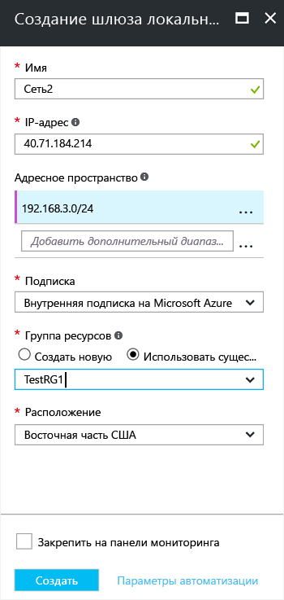

1. На портале в разделе **Все ресурсы** щелкните **+ Добавить**. 
2. В поле поиска на странице **Все** выполните поиск по словам **шлюз локальной сети**. В результате будет возвращен список. Щелкните **Шлюз локальной сети**, а затем — **Создать**, чтобы открыть страницу **Создание шлюза локальной сети**.

  

3. На странице **Создание шлюза локальной сети** укажите значения для своего шлюза.

  - **Имя** — укажите имя для объекта шлюза локальной сети.
  - **IP-адрес** — это общедоступный IP-адрес VPN-устройства, к которому вы хотите подключиться. Укажите допустимый общедоступный IP-адрес. Этот IP-адрес не может быть скрыт за NAT и должен быть доступен для Azure. Если у вас сейчас нет IP-адреса, вы можете использовать значения, показанные на снимке экрана. Но позже вам нужно будет заменить заполнитель IP-адреса общедоступным IP-адресом устройства VPN. Иначе Azure не удастся установить подключение.
  - **Адресное пространство** обозначает диапазон адресов для сети, которую представляет эта локальная сеть. Можно добавить несколько диапазонов пространства адресов. Убедитесь, что указанные диапазоны не перекрывают диапазоны других сетей, к которым необходимо подключиться. Azure будет маршрутизировать указанный диапазон адресов на IP-адрес локального VPN-устройства. *Используйте собственные значения, а не значения, показанные на снимке экрана*.
  - **Настройка параметров BGP** — используйте только при настройке BGP. В противном случае не выбирайте этот параметр.
  - **Подписка** — убедитесь, что указана правильная подписка.
  - **Группа ресурсов** — выберите нужную группу ресурсов. Можно создать новую группу ресурсов или выбрать уже созданную.
  - **Расположение** — укажите расположение, в котором будет создан этот объект. Вы можете выбрать расположение, в котором размещена виртуальная сеть, но это не обязательно.

4. Завершив ввод значений, щелкните **Создать** в нижней части страницы, чтобы создать шлюз локальной сети.