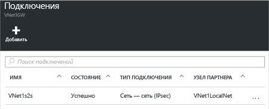

1. Найдите свой шлюз виртуальной сети и щелкните **Все параметры**. Откроется колонка **Параметры**.

2. В колонке **Параметры** щелкните **Подключения**, а затем в верхней части колонки нажмите кнопку **Добавить**. Откроется колонка **Добавить подключение**.

	

3. В колонке **Добавить подключение** укажите для своего подключения **имя**.

4. В раскрывающемся списке **Тип подключения** выберите **Сеть — сеть (IPSec)**.

5. Значение параметра **Шлюз виртуальной сети** изменить нельзя, так как вы подключаетесь из этого шлюза.

6. В разделе **Шлюз локальной сети** щелкните **Выбрать шлюз локальной сети** и выберите нужный шлюз.

7. Значение в поле **Общий ключ** должно соответствовать ключу локального VPN-устройства. Если VPN-устройство локальной сети не предоставляет общего ключа, можно придумать воображаемый ключ и ввести его здесь и на локальном устройстве. Важно, чтобы оба ключа совпадали.

8. Значения параметров **Подписка**, **Группа ресурсов** и **Расположение** изменить нельзя.

9. Щелкните **ОК** для создания подключения. На экране появится надпись *Идет создание подключения*.

10. Когда подключение будет создано, оно появится в колонке **Подключения** вашего шлюза.

	

<!---HONumber=AcomDC_0406_2016---->