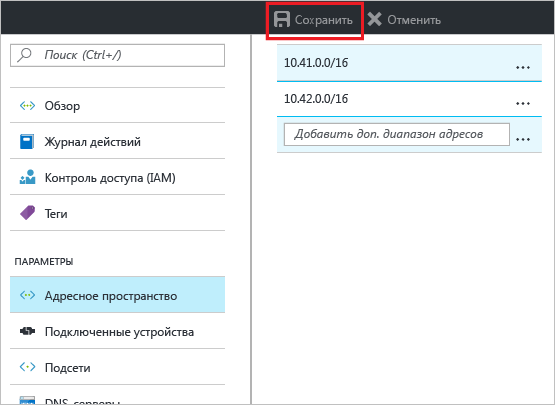
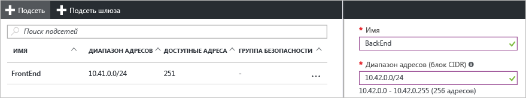

### Добавление дополнительного адресного пространства

1. Чтобы добавить дополнительное адресное пространство, в разделе **Параметры** страницы виртуальной сети щелкните **Адресное пространство**, чтобы открыть страницу пространства адресов.
2. Добавьте дополнительное пространство и щелкните **Сохранить** в верхней части страницы.

  

### Создание дополнительных подсетей

1. Чтобы создать подсети, в разделе **Параметры** страницы виртуальной сети щелкните **Подсети**, чтобы открыть страницу **Подсети**. 
2. На странице "Подсети" щелкните **+Подсеть**. Откроется страница **Добавление подсети**. Укажите имя новой подсети и диапазон адресов.

  
3. Чтобы сохранить изменения, в нижней части страницы щелкните **ОК**.

  