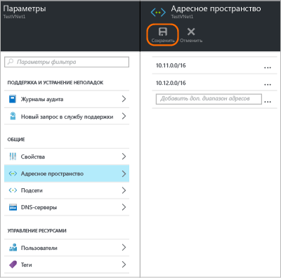
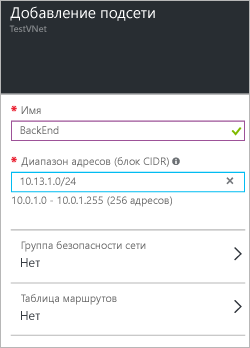

### Добавление адресного пространства

1. Чтобы добавить дополнительное адресное пространство, нажмите кнопку **Все параметры**. Откроется колонка **Параметры**. 

2. В колонке **Параметры** щелкните **Адресное пространство**. Откроется колонка адресного пространства. Добавьте дополнительное пространство и в верхней части колонки нажмите кнопку **Сохранить**.

	

### Добавление подсетей 

1. Чтобы добавить в адресные пространства дополнительные подсети, в колонке **Параметры** щелкните **Подсети**. Откроется колонка **Подсети**. 

2. В колонке подсетей щелкните **Добавить**. Откроется колонка **Добавление подсети**. Укажите имя новой подсети и ее диапазон адресов, а затем в нижней части колонки нажмите кнопку **ОК**. Когда подсеть будет создана, в колонке подсетей вы сможете просмотреть все подсети виртуальной сети.

	

<!---HONumber=AcomDC_0406_2016---->