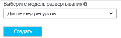

Чтобы создать виртуальную сеть на основе модели развертывания Resource Manager, используя портал Azure, следуйте инструкциям ниже. Снимки экрана приведены в качестве примеров. Обязательно подставьте собственные значения. Дополнительные сведения о работе с виртуальными сетями см. в статье [Обзор виртуальной сети](../articles/virtual-network/virtual-networks-overview.md).

1. В браузере откройте [портал Azure](http://portal.azure.com) и при необходимости войдите с помощью учетной записи Azure.
2. В нижней части страницы нажмите кнопку **+**. В поле **Поиск по Marketplace** введите "Виртуальная сеть". Найдите **Виртуальная сеть** в результатах поиска и щелкните ее, чтобы открыть страницу **Виртуальная сеть**.

  
3. В нижней части страницы "Виртуальная сеть" из списка **Выберите модель развертывания** выберите **Resource Manager** и щелкните **Создать**.

  
4. На странице **Создание виртуальной сети** настройте параметры виртуальной сети. Если введенные в полях значения допустимы, красный восклицательный знак сменится зеленой галочкой. Некоторые значения могут быть заполнены автоматически. В таком случае подставьте собственные значения. Страница **Создать виртуальную сеть** выглядит, как на рисунке ниже:

  
5. **Имя**. Введите имя виртуальной сети.
6. **Адресное пространство**. Введите адресное пространство. Если их несколько, добавьте первое адресное пространство. Дополнительные адресные пространства можно добавить позже, после создания виртуальной сети.
7. **Имя подсети**. Добавьте имя подсети и диапазон адресов подсети. Дополнительные подсети можно добавить позже, после создания виртуальной сети.
8. **Подписка**. Убедитесь, что указана правильная подписка. Подписки можно менять с помощью раскрывающегося списка.
9. **Группа ресурсов**. Выберите существующую группу ресурсов или создайте новую. Чтобы создать новую группу, введите ее имя. Если вы создаете группу ресурсов, укажите для нее имя, которое будет использоваться в вашей конфигурации. Дополнительные сведения о группах ресурсов см. в разделе "Группы ресурсов" [обзора Azure Resource Manager](../articles/azure-resource-manager/resource-group-overview.md#resource-groups).
10. **Расположение**. Выберите расположение для виртуальной сети. Расположение определяет, где будут находиться ресурсы, развертываемые в этой виртуальной сети.
11. Установите флажок **Закрепить на панели мониторинга** для быстрого перехода к виртуальной сети с панели мониторинга, а затем нажмите кнопку **Создать**.

 
12. После нажатия кнопки **Создать** вы увидите плитку на панели мониторинга, на которой отображается ход создания виртуальной сети. Когда виртуальная сеть будет создана, плитка изменится.

  