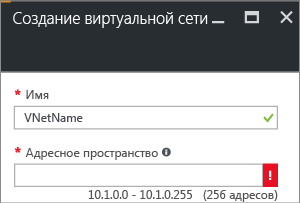
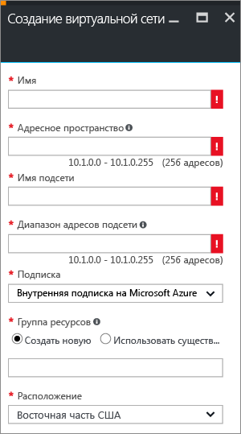

Чтобы создать виртуальную сеть с помощью портала Azure, выполните указанные ниже действия. Снимки экрана приведены в качестве примеров. Обязательно подставьте собственные значения. Дополнительные сведения о работе с виртуальными сетями см. в статье [Обзор виртуальной сети](../articles/virtual-network/virtual-networks-overview.md).

1. В браузере откройте [портал Azure](http://portal.azure.com) и при необходимости войдите с использованием учетной записи Azure.

2. Нажмите кнопку **Создать**. В поле **Поиск по Marketplace** введите "Виртуальная сеть". Найдите **виртуальную сеть** в результатах поиска и щелкните ее, чтобы открыть колонку **виртуальной сети**.

	

3. В нижней части колонки "Виртуальная сеть" из списка **Выберите модель развертывания** выберите **Диспетчер ресурсов** и щелкните **Создать**.

	

4. В колонке **Создание виртуальной сети** настройте параметры виртуальной сети. Если введенные в полях значения допустимы, красный восклицательный знак сменится зеленой галочкой.

	

5. Колонка **Создать виртуальную сеть** выглядит, как на рисунке ниже. Некоторые значения могут быть заполнены автоматически. В таком случае подставьте собственные значения.

	

6. **Имя**. Введите имя виртуальной сети.

7. **Адресное пространство**. Введите адресное пространство. Если их несколько, добавьте первое адресное пространство. Дополнительные адресные пространства можно добавить позже, после создания виртуальной сети.
 
8. **Имя подсети**. Добавьте имя подсети и диапазон адресов подсети. Дополнительные подсети можно добавить позже, после создания виртуальной сети.

10. **Подписка**. Убедитесь, что указана правильная подписка. Подписки можно менять с помощью раскрывающегося списка.

11. **Группа ресурсов**. Выберите имеющуюся группу ресурсов или создайте новую. Чтобы создать новую группу, введите ее имя. Если вы создаете группу ресурсов, укажите для нее имя, которое будет использоваться в вашей конфигурации. Дополнительные сведения о группах ресурсов см. в статье [Общие сведения о диспетчере ресурсов Azure](resource-group-overview.md#resource-groups).

12. **Расположение**. Выберите расположение для виртуальной сети. Расположение определяет, где будут находиться ресурсы, развертываемые в этой виртуальной сети.

13. Установите флажок **Закрепить на панели мониторинга** для быстрого перехода к виртуальной сети с панели мониторинга, а затем нажмите кнопку **Создать**.
	
	

14. После нажатия кнопки **Создать** на панели мониторинга появится плитка, на которой отображается ход создания виртуальной сети. Когда виртуальная сеть будет создана, плитка изменится.

	

<!---HONumber=AcomDC_1005_2016-->