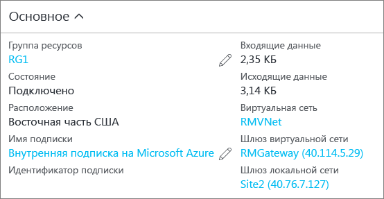

### <a name="to-verify-your-connection-by-using-powershell"></a>Проверка подключения с помощью PowerShell

Убедиться в успешном выполнении подключения можно с помощью командлета Get-AzureRmVirtualNetworkGatewayConnection с параметром -Debug или без него. 

1. Используйте командлет из следующего примера, подставив свои значения. При появлении запроса выберите "A", чтобы выполнить команду All (Все). В примере параметр -Name ссылается на имя созданного подключения, которое нужно проверить.

  ```powershell
  Get-AzureRmVirtualNetworkGatewayConnection -Name MyGWConnection -ResourceGroupName MyRG
  ```
2. После завершения работы командлета просмотрите результаты. В следующем примере показано, что подключение установлено (состояние "Подключено"), а также указан объем полученных и отправленных данных в байтах.

  ```
  "connectionType": "IPsec",
  "routingWeight": 10,
  "sharedKey": "abc123",
  "connectionStatus": "Connected",
  "ingressBytesTransferred": 33509044,
  "egressBytesTransferred": 4142431
  ```

### <a name="to-verify-your-connection-by-using-the-azure-portal"></a>Проверка подключения с помощью портала Azure

Чтобы просмотреть состояние подключения на портале Azure, перейдите к нужному подключению. Это можно сделать несколькими способами. Ниже показано, как перейти к подключению и проверить его.

1. На [портале Azure](http://portal.azure.com) щелкните **Все ресурсы** и перейдите к шлюзу виртуальной сети.
2. В колонке шлюза виртуальной сети щелкните **Подключения**. Вы увидите состояние каждого подключения.
3. Чтобы открыть вкладку **Основные компоненты**, щелкните имя подключения, которое необходимо проверить. На вкладке "Основные компоненты" можно просмотреть дополнительные сведения о подключении. В случае успешного подключения будет отображаться **состояние** "Успешно" и "Подключено".
   
    